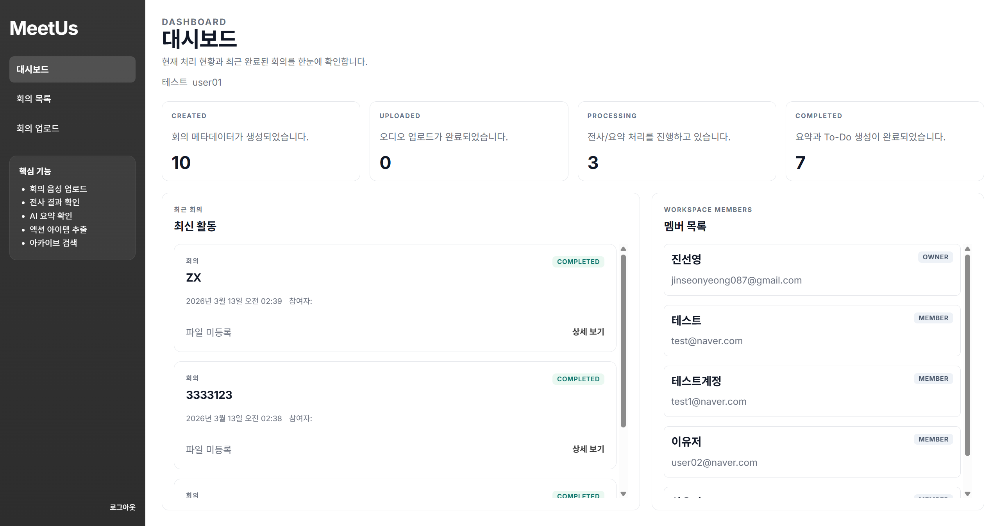
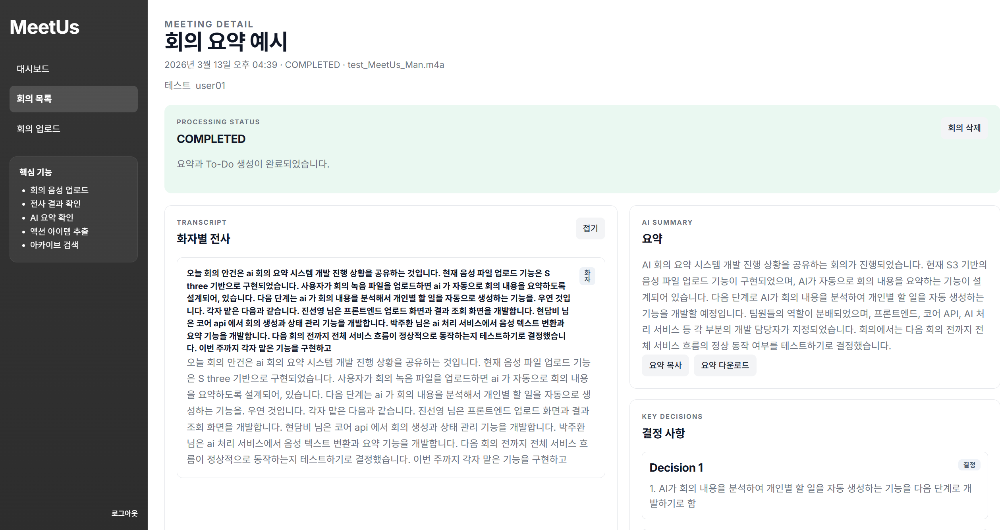
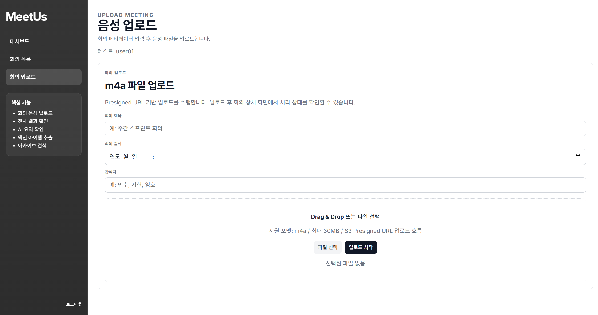

# AA 작업 증적 (Frontend / Integration / Infra)

## 1) 프로젝트 개요

AI Minutes 프로젝트는 사용자가 회의 음성 파일을 업로드하면 전사, 요약, 결정사항, 개인별 To-Do를 생성하고 이를 다시 조회할 수 있도록 구성된 서비스다.

전체 구조는 프론트엔드, Core API, AI 처리 파이프라인, 데이터 저장소, AWS 배포 리소스로 나뉜다.

- 프론트엔드는 업로드, 목록, 상세 조회 화면을 제공한다.
- Core API는 회의 생성, 업로드 제어, 상태 관리, 결과 조회를 담당한다.
- AI 처리 파이프라인은 음성 데이터를 전사와 요약 결과로 변환한다.
- 데이터 저장소는 회의 메타데이터와 결과 데이터를 보관한다.
- AWS 리소스는 서비스 배포, 라우팅, 저장, 로그 수집을 담당한다.

---

## 2) AA 목표

- 클라우드 기반 서비스 배포 구조 이해
- AWS 프론트 배포 경험 정리
- 환경별 운영 기준 문서화
- 화면, API, 배포 문서 간 정합성 확보

---

## 3) 환경 구분

운영 환경은 `local`, `dev`, `stage`, `prod` 4개로 구분한다.

| 환경 | 목적 | 실행 기준 | 진입점 | 배포 기준 |
| --- | --- | --- | --- | --- |
| `local` | 개인 개발 및 기본 확인 | 로컬 실행 | `localhost` | 화면 및 API 연결 확인 |
| `dev` | 팀 통합 개발 | 개발 배포본 | dev URL 또는 내부 ALB | 기능 연동 및 상태 흐름 확인 |
| `stage` | 운영 전 검증 | 운영 유사 환경 | stage ALB DNS | 배포 검증 및 리허설 |
| `prod` | 실제 운영 | 운영 배포본 | 운영 도메인 또는 운영 ALB | 실서비스 운영 및 롤백 대응 |

### 3.1 Local

- 로컬 브라우저 기준 개발 및 기능 확인 환경
- UI와 API 연결 여부 점검

### 3.2 Dev

- 팀 단위 통합 개발 환경
- 프론트와 Core API 연동 검증

### 3.3 Stage

- 운영 전 검증 환경
- ECS, ALB, Task Definition, CodeDeploy 흐름 확인

### 3.4 Prod

- 실제 운영 환경
- 운영값 기준 배포 및 장애 대응

---

## 4) 산출물

- [화면설계서](./ui-spec.md)
- [사용자 흐름도](./user-flow.md)
- [API 연동 정리](./api-integration.md)
- [Frontend 시스템 설계](./frontend-system-design.md)
- [배포 구조 문서](./deployment-architecture.md)
- [AA 클라우드 및 배포 작업 정리](./aa-frontend-deploy-summary.md)
- [통합 API 명세](../COMMON/api-specification-integrated.md)
- [시스템 플로우차트](../COMMON/system-flowchart.md)
- [네트워크 구성도](../COMMON/network-topology.md)
- [아키텍처 다이어그램](../COMMON/architecture-diagram.md)
- [MSA 플로우차트](../COMMON/ai-minutes-msa-flowchart-horizontal-highlight.mmd)
- [TA API 명세](../TA/api-spec.md)

---

## 5) AA 작업 범위

### 5.1 문서화

- 회의 업로드, 목록, 상세 화면의 사용자 흐름 문서화
- Core API 연동 기준 정리
- 상태값 기반 UI 문서 정리
- 배포 구조 및 화면 설계 문서 정리

### 5.2 배포 관련 산출물

- [frontend/Dockerfile](../frontend/Dockerfile)
- [frontend/runtime-config.js](../frontend/runtime-config.js)
- [frontend/deploy/taskdef-frontend.template.json](../frontend/deploy/taskdef-frontend.template.json)
- [frontend/deploy/appspec-frontend.yaml](../frontend/deploy/appspec-frontend.yaml)

### 5.3 문서 정합화

- 구버전 API 경로 제거
- camelCase / snake_case 혼용 정리
- OpenAI 표기 제거, Amazon Bedrock 기준으로 정리
- Mermaid 렌더링 오류 수정
- NAT 의존 표기 제거

---

## 6) 상태값 기준

프론트 문서와 API 문서에서 공통으로 사용하는 회의 상태값은 아래와 같다.

| 상태 | 의미 |
| --- | --- |
| `CREATED` | 회의 메타데이터 생성 완료 |
| `UPLOADED` | 오디오 업로드 완료 |
| `PROCESSING` | AI 처리 진행 중 |
| `COMPLETED` | 결과 생성 완료 |
| `FAILED` | 처리 실패 |

관련 API:

- `POST /workspaces/{workspaceId}/meetings`
- `POST /meetings/{meetingId}/upload-url`
- `POST /meetings/{meetingId}/upload-complete`
- `POST /meetings/{meetingId}/process`
- `POST /meetings/{meetingId}/retry`
- `GET /todos`
- `PATCH /todos/{todoId}`

---

## 7) AA 구성 및 흐름

### 7.1 AA 서비스 흐름

- `User`
  - 사용자
- `ALB`
  - 프론트 진입점
- `Frontend ECS Service`
  - 프론트 화면 제공
- `Core API ECS Service`
  - 회의 생성, 업로드 URL 발급, 결과 조회 처리
- `S3`
  - 회의 음성 파일 저장소
- `AI Processing Service`
  - 전사, 요약, 액션아이템 생성
- `RDS`
  - 회의 및 결과 데이터 저장
- `CloudWatch`
  - 로그 수집

1. 사용자가 브라우저에서 서비스에 접속한다.
2. 요청은 `ALB` 를 거쳐 `Frontend ECS Service` 로 전달된다.
3. 프론트는 회의 생성, 업로드 URL 발급, 결과 조회 등을 위해 `Core API ECS Service` 를 호출한다.
4. 사용자는 `Presigned URL` 을 사용해 회의 음성을 `S3` 에 직접 업로드한다.
5. `AI Processing Service` 가 `S3` 의 음성을 읽고 결과를 생성한다.
6. 처리 결과는 `RDS` 에 저장되고, 프론트는 `Core API` 를 통해 다시 조회한다.
7. 프론트 컨테이너에서 발생한 로그는 `CloudWatch` 로 수집된다.

### 7.2 AA CI/CD 흐름

- `GitHub`
  - 소스 저장소
- `IAM`
  - AWS 접근 권한
- `GitHub Actions`
  - 배포 자동화 실행 주체
- `Docker Build`
  - Docker 이미지 생성
- `ECR`
  - 이미지 저장소
- `CodeDeploy`
  - ECS 배포 제어
- `ECS Frontend Service`
  - 운영 서비스

1. 프론트 코드를 `GitHub` 에 푸시한다.
2. `GitHub Actions` 가 실행된다.
3. `IAM` 권한을 이용해 AWS 리소스에 접근한다.
4. `Docker Build` 로 프론트 이미지를 생성한다.
5. 생성한 이미지를 `ECR` 에 푸시한다.
6. `CodeDeploy` 가 ECS 배포를 제어한다.
7. `ECR` 의 최신 이미지를 `ECS Frontend Service` 가 pull 받아 실행한다.
8. `CodeDeploy` 가 새 버전을 반영하거나 트래픽 전환을 관리한다.

---

## 8) 캡처 증적 재배치

### 8.1 AWS 권한 및 사전 준비

- [IAM User](./img/IAMuser.png)
- [ECR Repository](./img/ECRrepository.png)
- [S3 Bucket](./img/S3_Bucket.png)
- [Bucket Policy](./img/Bucket_Policy.png)
- [S3 CORS](./img/CORS.png)

### 8.2 프론트 인프라 생성 증적

- [ECS Cluster](./img/ECS_cluster.png)
- [Docker build](./img/docker_image.png)
- [Docker tag](./img/image_tag.png)
- [ECR Push](./img/ECR_push.png)
- [Target Group](./img/targetgroup.png)
- [Security Group](./img/security_group.png)
- [80 port rule](./img/80port.png)
- [ALB 생성](./img/ALB_create.png)
- [Listener 생성](./img/Listener_create.png)
- [ECS Task Definition](./img/ECS_Task_Definition.png)
- [ECS Service](./img/ECS_service.png)

### 8.3 화면 산출물
대시보드

요약화면

업로드

---

## 9) AWS 배포 결과 요약

### 9.1 실제 복원 가능한 주요 값

- AWS Region: `ap-northeast-2`
- AWS Account ID: `712517669691`
- VPC ID: `vpc-0089632e69a22170c`
- Subnet IDs: `subnet-0a54251f681a6c4a3`, `subnet-0143854fb8aed0463`
- ALB SG: `sg-090016810b3e0bee4`
- ECS Frontend SG: `sg-025cf55ad88f862f4`
- ECS Cluster: `meetus-cluster`
- ECS Service: `meetus-frontend-service`
- ECS Task Family: `meetus-frontend-task`
- Frontend ALB DNS: `ai-minutes-frontend-alb-826201136.ap-northeast-2.elb.amazonaws.com`
- Core API Base URL: `http://meetus-alb-858165370.ap-northeast-2.elb.amazonaws.com`

### 9.2 실제 배포 흐름 요약

1. 서브넷과 Security Group을 확인 및 생성했다.
2. ALB, Listener, Target Group을 구성했다.
3. Docker 이미지 빌드 후 ECR에 push 했다.
4. ECS Cluster와 Task Definition을 등록했다.
5. ECS Service를 생성하고 CodeDeploy 기준 배포 구조를 맞췄다.
6. 재배포 시 `force-new-deployment`로 최신 이미지를 반영했다.

### 9.3 연결되는 파일

- [frontend/runtime-config.js](../frontend/runtime-config.js)
- [frontend/deploy/taskdef-frontend.template.json](../frontend/deploy/taskdef-frontend.template.json)
- [frontend/deploy/appspec-frontend.yaml](../frontend/deploy/appspec-frontend.yaml)

---

## 10) 트러블슈팅

### 10.1 새 이미지를 밀었는데 반영이 안 됨

- 원인: `latest` 태그만 변경되고 ECS가 기존 태스크를 유지
- 조치: `aws ecs update-service --force-new-deployment`

### 10.2 Security Group 연결 오류

- 원인: ECS 서비스에 맞는 SG 분리가 되지 않음
- 조치: ECS Frontend SG를 별도 생성하고 ALB source rule만 허용

### 10.3 리소스명 혼재

- 원인: 초기 수동 구성과 이후 정리된 변수 기반 배포가 혼재
- 조치: 실제 실행 흔적과 최종 운영 구조를 분리해 문서화

### 10.4 API Base URL 정합성

- 원인: 프론트 환경변수의 `API_BASE_URL` 과 Core API 주소 불일치 가능성
- 조치: Task Definition과 런타임 설정값 확인

### 10.5 CloudWatch Logs 미생성

- 원인: 로그 그룹이 없으면 태스크 원인 확인이 어려움
- 조치: `/ecs/meetus-frontend` 로그 그룹 생성

---

## 11) 최종 요약

- AA는 화면 설계, 사용자 흐름, API 연동, 배포 구조 문서를 정리했다.
- AA는 AWS 프론트 배포 경험을 기준으로 ECS, ALB, ECR, CodeDeploy 흐름을 정리했다.
- AA는 `local`, `dev`, `stage`, `prod` 4개 환경 구분을 문서화했다.
- AA는 실제 배포 증적과 주요 AWS 리소스 값을 정리했다.
- AI Minutes 프로젝트는 회의 음성 업로드부터 전사, 요약, To-Do 조회, 클라우드 배포까지 이어지는 전체 서비스 흐름을 다루는 프로젝트다.
