# AA 작업 증적 (Frontend / Integration / Infra)

본 문서는 AA 파트에서 수행한 화면 설계, 문서 정리, AWS 프론트 배포, 재배포, 트러블슈팅, 권한 확인 내역을 순서대로 정리한 증적 문서다.

작업 흐름:
`요건 정리 -> 요건 분석 -> 설계 -> 구축 -> AWS 배포 -> 재배포 및 검증 -> 트러블슈팅 -> 증적 정리`

## 1) 산출물

- [화면설계서](./ui-spec.md)
- [사용자 흐름도](./user-flow.md)
- [API 연동 정리](./api-integration.md)
- [Frontend 시스템 설계](./frontend-system-design.md)
- [배포 구조 문서](./deployment-architecture.md)
- [AA 프론트 배포 및 환경 운영 정리](./aa-frontend-deploy-summary.md)
- [통합 API 명세](../COMMON/api-specification-integrated.md)
- [시스템 플로우차트](../COMMON/system-flowchart.md)
- [네트워크 구성도](../COMMON/network-topology.md)
- [아키텍처 다이어그램](../COMMON/architecture-diagram.md)
- [MSA 플로우차트](../COMMON/ai-minutes-msa-flowchart-horizontal-highlight.mmd)
- [TA API 명세](../TA/api-spec.md)

## 2) 작업 개요

### 2.1 요건 정리

- 목표:
  - 회의 업로드부터 요약/To-Do 조회까지의 프론트 사용자 흐름 정의
  - 백엔드 API 스펙과 프론트 화면 흐름 정합화
  - AWS 상에서 Frontend ECS + ALB 배포 경로 확보

### 2.2 요건 분석

- 핵심 분석 포인트:
  - 비동기 상태값 `CREATED`, `UPLOADED`, `PROCESSING`, `COMPLETED`, `FAILED` 기반 UI 필요
  - 업로드는 Presigned URL 기반 브라우저 -> S3 직접 업로드 구조 필요
  - 목록, 상세, 상태 재확인, 재처리 흐름 필요
- TA 최신 스펙 기준 반영 API:
  - `POST /workspaces/{workspaceId}/meetings`
  - `POST /meetings/{meetingId}/upload-url`
  - `POST /meetings/{meetingId}/upload-complete`
  - `POST /meetings/{meetingId}/process`
  - `POST /meetings/{meetingId}/retry`
  - `GET /todos`
  - `PATCH /todos/{todoId}`

### 2.3 설계 및 구축

- 문서 정합화:
  - 구버전 API 경로 제거
  - camelCase / snake_case 혼용 정리
  - OpenAI 표기 제거, Amazon Bedrock 기준으로 정리
  - Mermaid 렌더링 오류 수정
  - NAT 의존 표기 제거
- 프론트 코드 연동 기준:
  - [workspaceApi](../frontend/api/workspaceApi.js)
  - [meetingsApi](../frontend/api/meetingsApi.js)
  - [workspaces page](../frontend/pages/workspaces.js)
  - [runtime config](../frontend/runtime-config.js)

## 3) AA 구성 및 흐름

발표는 아래 순서로 설명하면 가장 자연스럽다.

`서비스 흐름 설명 -> CI/CD 배포 흐름 설명 -> 실제 AWS 증적 제시 -> 트러블슈팅 설명`

### 3.1 AA 서비스 흐름


이 그림은 사용자가 프론트 서비스에 접속하고, 프론트가 백엔드 및 스토리지와 연동되는 전체 서비스 흐름을 보여준다.

- `User`
  - 실제 서비스를 사용하는 사용자
- `ALB`
  - 사용자의 웹 요청을 가장 먼저 받는 프론트 진입점
- `Frontend ECS Service`
  - 사용자가 보는 프론트 페이지를 실제로 서비스하는 컨테이너
- `Core API ECS Service`
  - 회의 생성, 업로드 URL 발급, 결과 조회를 처리하는 백엔드 API
- `S3`
  - 회의 음성 파일이 업로드되는 저장소
- `AI Processing Service`
  - S3의 음성 파일을 읽고 전사/요약/액션아이템을 생성하는 처리 서비스
- `RDS`
  - 회의 메타데이터, 전사, 요약, 액션아이템 결과를 저장하는 데이터베이스
- `CloudWatch`
  - 프론트 ECS 로그를 수집하고 확인하는 운영 로그 저장소

서비스 흐름 해석:

1. 사용자가 브라우저에서 서비스에 접속한다.
2. 요청은 `ALB` 를 거쳐 `Frontend ECS Service` 로 전달된다.
3. 프론트는 회의 생성, 업로드 URL 발급, 결과 조회 등을 위해 `Core API ECS Service` 를 호출한다.
4. 사용자는 `Presigned URL` 을 사용해 회의 음성을 `S3` 에 직접 업로드한다.
5. `AI Processing Service` 가 `S3` 의 음성을 읽고 결과를 생성한다.
6. 처리 결과는 `RDS` 에 저장되고, 프론트는 `Core API` 를 통해 다시 조회한다.
7. 프론트 컨테이너에서 발생한 로그는 `CloudWatch` 로 수집된다.

발표할 때는 이렇게 말하면 된다.

- "사용자는 ALB를 통해 프론트 ECS로 들어오고, 프론트는 Core API와 통신합니다."
- "회의 음성은 Presigned URL을 사용해서 S3에 직접 업로드됩니다."
- "AI Processing Service가 음성을 처리한 뒤 RDS에 결과를 저장하고, 프론트가 다시 조회해서 보여주는 구조입니다."

### 3.2 AA CI/CD 흐름


이 그림은 프론트 코드가 변경됐을 때 자동으로 배포되는 CI/CD 흐름을 보여준다.

- `GitHub`
  - 프론트 코드가 올라가는 저장소
- `IAM`
  - GitHub Actions가 AWS 리소스를 건드릴 수 있게 해주는 권한
- `GitHub Actions`
  - 자동 배포 실행 주체
  - 코드 변경 감지 후 빌드/배포 시작
- `Docker Build`
  - 프론트 코드를 Docker 이미지로 만듦
- `ECR`
  - 만들어진 Docker 이미지를 저장하는 AWS 이미지 저장소
- `CodeDeploy`
  - ECS에 새 버전을 반영하고, 필요하면 Blue-Green 배포를 제어
- `ECS Frontend Service`
  - 실제로 프론트가 떠 있는 서비스

배포 흐름 해석:

1. 프론트 코드를 `GitHub` 에 푸시한다.
2. `GitHub Actions` 가 실행된다.
3. `IAM` 권한을 이용해 AWS 리소스에 접근한다.
4. `Docker Build` 로 프론트 이미지를 생성한다.
5. 생성한 이미지를 `ECR` 에 푸시한다.
6. `CodeDeploy` 가 ECS 배포를 제어한다.
7. `ECR` 의 최신 이미지를 `ECS Frontend Service` 가 pull 받아 실행한다.
8. `CodeDeploy` 가 새 버전을 반영하거나 트래픽 전환을 관리한다.

발표할 때는 이렇게 말하면 된다.

- "코드를 GitHub에 올리면 GitHub Actions가 실행됩니다."
- "Actions가 Docker 이미지를 빌드해서 ECR에 올리고, CodeDeploy를 통해 ECS 프론트 서비스에 반영합니다."
- "즉 프론트 배포는 GitHub Actions, Docker, ECR, ECS, CodeDeploy로 자동화했습니다."

## 4) 캡처 증적 재배치

- 아래 캡처는 현재 `AA/img` 폴더에 남아 있는 파일만 사용했다.
- 일부 예전 증적은 삭제된 상태라 제외했고, 어제 CLI로 생성하거나 갱신한 리소스 흐름에 맞춰 다시 배치했다.

### 4.1 AWS 권한 및 사전 준비

IAM User 권한 확인

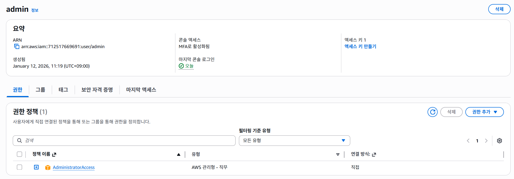

ECR Repository 생성

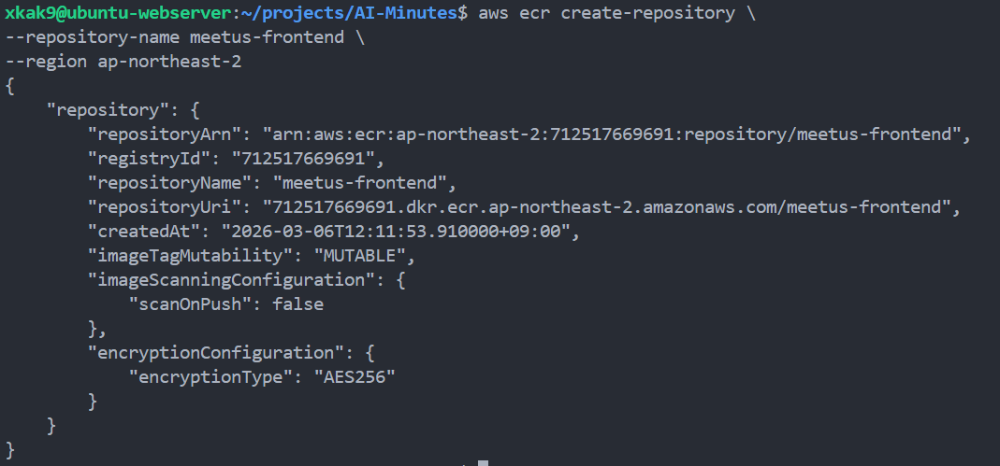

S3 Bucket 생성

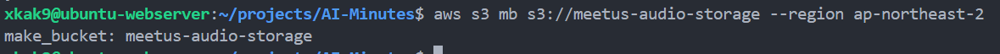

S3 Bucket 정책 추가

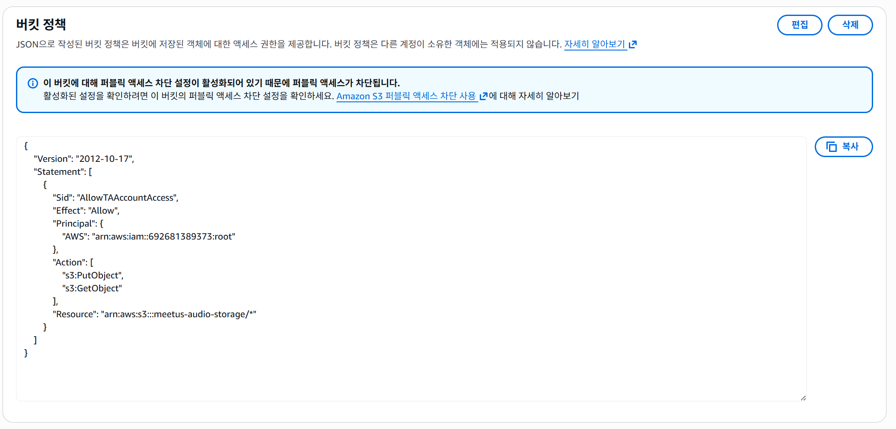

S3 Bucket CORS 설정

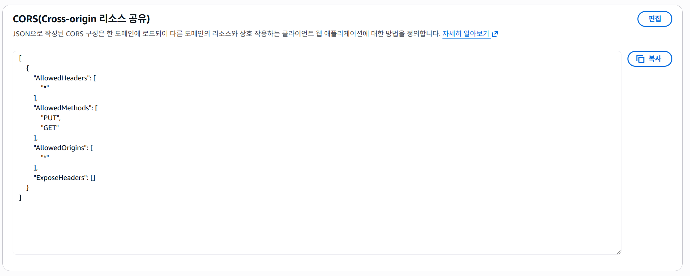

### 4.2 어제 CLI 기반 프론트 인프라 생성 순서

ECS Cluster 생성

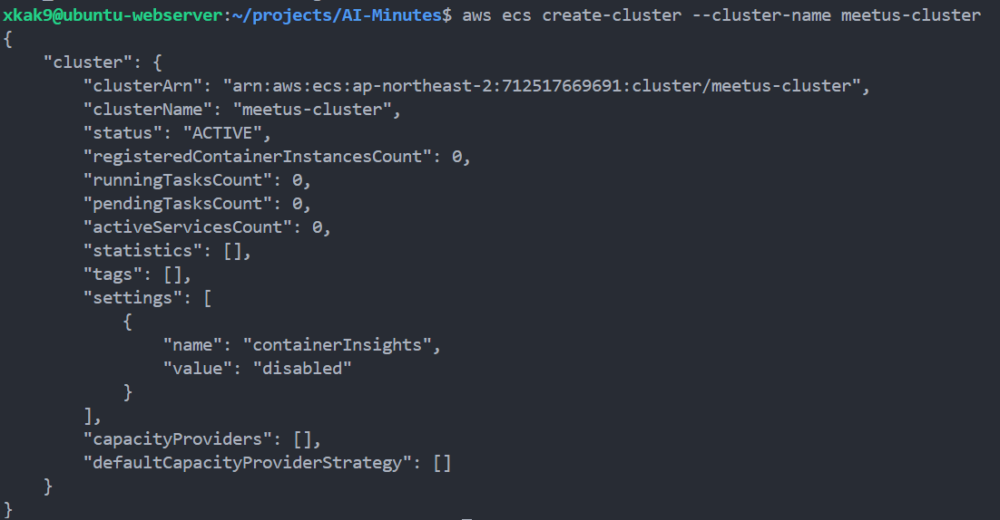

Docker 이미지 빌드

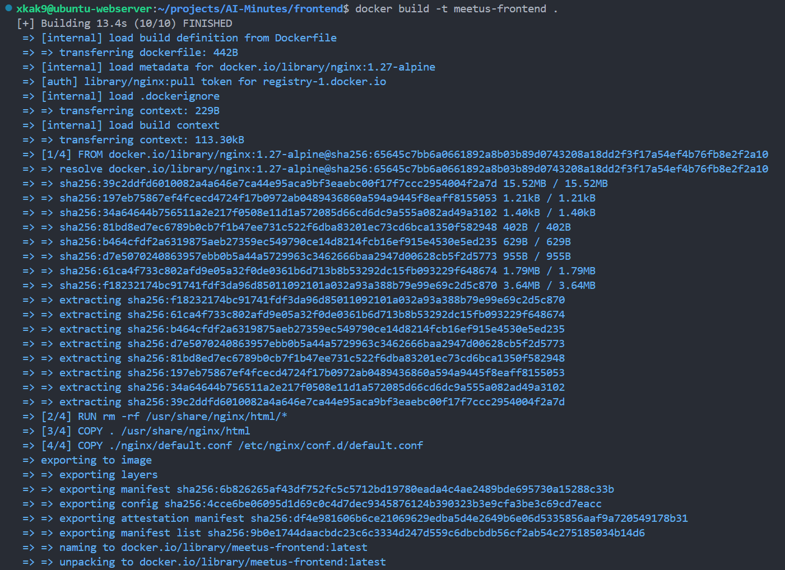

Docker 이미지 태그

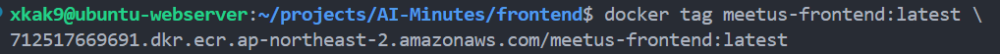

ECR Push

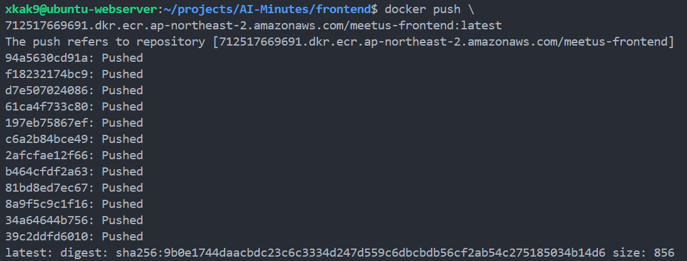

Target Group 생성


Security Group 생성

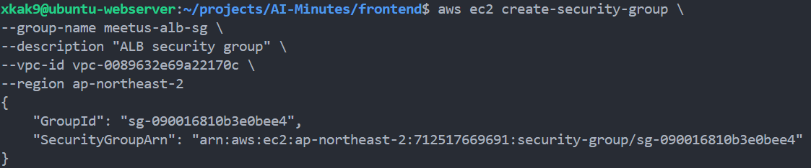

80 port 허용

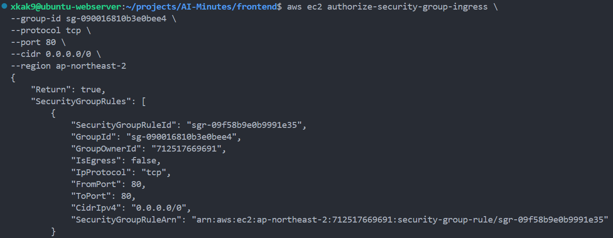

ALB 생성

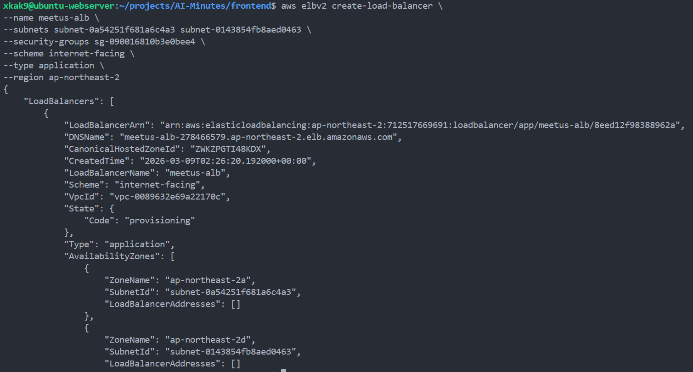

Listener 생성

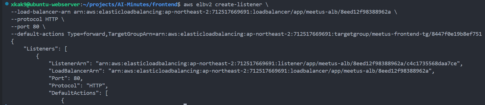

ECS Task Definition 생성

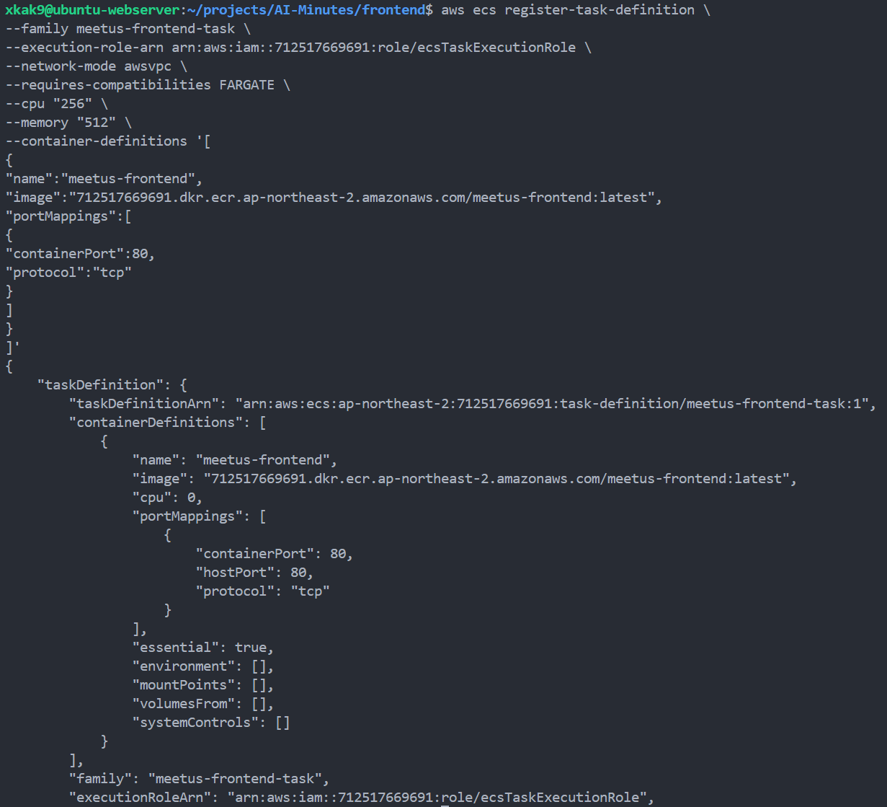

ECS Service 생성

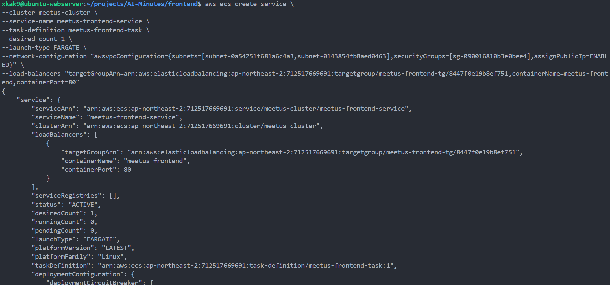


### 4.3 화면 산출물

초안


AA 산출물

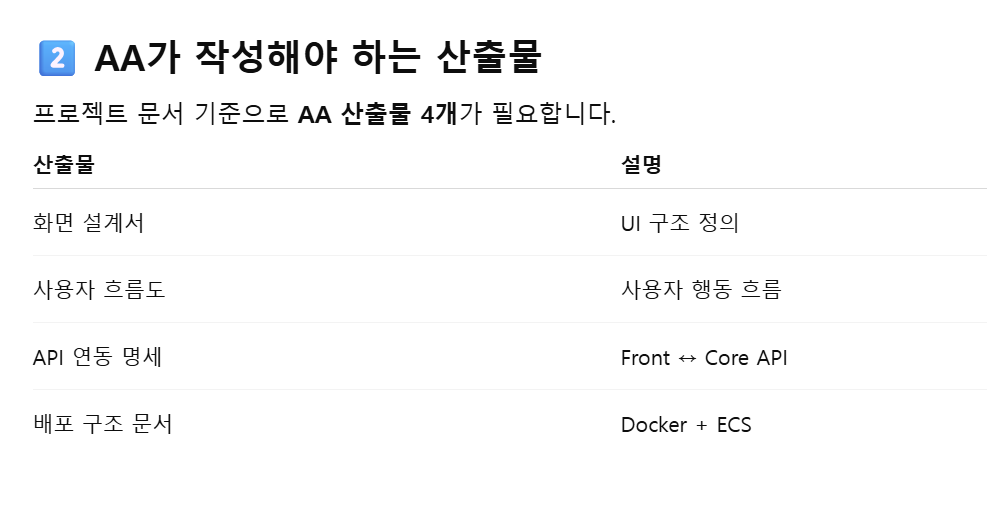

## 5) AWS 프론트 배포 실제 실행 기록

- 아래 명령들은 `/home/xkak9/.bash_history` 에서 확인한 실제 실행 명령 기준으로 정리했다.
- 출력 전체는 히스토리에 남지 않으므로, 이후 `export` 값과 캡처로 복원 가능한 결과를 함께 기록했다.
- 기준 날짜:
  - 최초 구성 및 반복 시도 포함
  - 2026-03-11 전후 재배포 흐름 반영

### 5.1 실제 복원 가능한 리소스 값

- AWS Region: `ap-northeast-2`
- AWS Account ID: `712517669691`
- VPC ID: `vpc-0089632e69a22170c`
- Subnet 1: `subnet-0a54251f681a6c4a3`
- Subnet 2: `subnet-0143854fb8aed0463`
- ALB Security Group: `sg-090016810b3e0bee4`
- ECS Frontend Security Group: `sg-025cf55ad88f862f4`
- Blue Target Group ARN:
  - `arn:aws:elasticloadbalancing:ap-northeast-2:712517669691:targetgroup/meetus-frontend-tg/757e556869f1e5ac`
- Green Target Group ARN:
  - `arn:aws:elasticloadbalancing:ap-northeast-2:712517669691:targetgroup/meetus-frontend-green-tg/ac75cbf19c16a81b`
- Frontend ALB ARN:
  - `arn:aws:elasticloadbalancing:ap-northeast-2:712517669691:loadbalancer/app/ai-minutes-frontend-alb/036c24d5ab7e6a47`
- Frontend ALB DNS:
  - `ai-minutes-frontend-alb-826201136.ap-northeast-2.elb.amazonaws.com`
- Prod Listener ARN:
  - `arn:aws:elasticloadbalancing:ap-northeast-2:712517669691:listener/app/ai-minutes-frontend-alb/036c24d5ab7e6a47/3f78bf0e518a9d32`
- Test Listener ARN:
  - `arn:aws:elasticloadbalancing:ap-northeast-2:712517669691:listener/app/ai-minutes-frontend-alb/036c24d5ab7e6a47/6b1dc36ecc0259a4`
- ECS Cluster: `meetus-cluster`
- ECS Service: `meetus-frontend-service`
- ECS Task Family: `meetus-frontend-task`
- ECR Repository:
  - 초기 시도: `meetus-frontend`
  - 이후 export 기준 정리: `ai-minutes-frontend`
- Core API Base URL:
  - `http://meetus-alb-858165370.ap-northeast-2.elb.amazonaws.com`

### 5.2 실제 실행 순서 기준 명령 정리

#### 1. 서브넷 조회 및 추가 생성

```bash
aws ec2 describe-subnets --query "Subnets[*].SubnetId" --output text
aws ec2 describe-subnets --filters "Name=vpc-id,Values=vpc-0089632e69a22170c" --query "Subnets[*].[SubnetId,AvailabilityZone]" --output table
aws ec2 create-subnet --vpc-id vpc-0089632e69a22170c --cidr-block 172.31.80.0/20 --availability-zone ap-northeast-2a --region ap-northeast-2
aws ec2 describe-subnets --filters "Name=vpc-id,Values=vpc-0089632e69a22170c" --query "Subnets[*].[SubnetId,AvailabilityZone]" --output table
```

- 하는 일:
  - VPC 안에 어떤 서브넷이 있는지 확인하고, 부족한 경우 새 서브넷을 추가한다.
- 결과 해석:
  - VPC는 `vpc-0089632e69a22170c`
  - 이후 실제 사용된 서브넷은 `subnet-0a54251f681a6c4a3`, `subnet-0143854fb8aed0463`

#### 2. ALB용 Security Group 생성 및 80 포트 개방

```bash
aws ec2 create-security-group --group-name meetus-alb-sg --description "ALB security group" --vpc-id vpc-0089632e69a22170c --region ap-northeast-2
aws ec2 authorize-security-group-ingress --group-id sg-090016810b3e0bee4 --protocol tcp --port 80 --cidr 0.0.0.0/0 --region ap-northeast-2
```

- 하는 일:
  - 인터넷에서 접근 가능한 ALB용 SG를 만들고 HTTP 80 포트를 전체에 개방한다.
- 복원된 실제 값:
  - ALB SG: `sg-090016810b3e0bee4`
- 결과:
  - 외부 브라우저 요청이 ALB 80 포트로 들어올 수 있는 상태

#### 3. 프론트 ALB 생성 및 리스너 연결

초기 시도:

```bash
aws elbv2 create-load-balancer --name meetus-alb --subnets subnet-0a54251f681a6c4a3 subnet-0143854fb8aed0463 --security-groups sg-090016810b3e0bee4 --scheme internet-facing --type application --region ap-northeast-2
aws elbv2 create-listener --load-balancer-arn arn:aws:elasticloadbalancing:ap-northeast-2:712517669691:loadbalancer/app/meetus-alb/8eed12f98388962a --protocol HTTP --port 80 --default-actions Type=forward,TargetGroupArn=arn:aws:elasticloadbalancing:ap-northeast-2:712517669691:targetgroup/meetus-frontend-tg/8447f0e19b8ef751
```

이후 Blue-Green 구성 정리 후 실제 복원값:

```bash
aws elbv2 create-load-balancer --name "$ALB_NAME" --subnets "$SUBNET_1" "$SUBNET_2" --security-groups "$ALB_SG" --scheme internet-facing --type application --ip-address-type ipv4 --region "$AWS_REGION"
aws elbv2 create-listener --load-balancer-arn "$ALB_ARN" --protocol HTTP --port 80 --default-actions Type=forward,TargetGroupArn="$TG_BLUE_ARN" --region "$AWS_REGION"
aws elbv2 create-listener --load-balancer-arn "$ALB_ARN" --protocol HTTP --port 8080 --default-actions Type=forward,TargetGroupArn="$TG_GREEN_ARN" --region "$AWS_REGION"
```

- 하는 일:
  - 프론트 진입점인 ALB를 만들고, 운영 리스너와 테스트 리스너를 각각 Blue / Green Target Group에 연결한다.
- 복원된 실제 값:
  - ALB ARN: `arn:aws:elasticloadbalancing:ap-northeast-2:712517669691:loadbalancer/app/ai-minutes-frontend-alb/036c24d5ab7e6a47`
  - Prod Listener ARN: `arn:aws:elasticloadbalancing:ap-northeast-2:712517669691:listener/app/ai-minutes-frontend-alb/036c24d5ab7e6a47/3f78bf0e518a9d32`
  - Test Listener ARN: `arn:aws:elasticloadbalancing:ap-northeast-2:712517669691:listener/app/ai-minutes-frontend-alb/036c24d5ab7e6a47/6b1dc36ecc0259a4`
  - Frontend ALB DNS: `ai-minutes-frontend-alb-826201136.ap-northeast-2.elb.amazonaws.com`

#### 4. Docker 이미지 빌드 및 Push

초기 시도:

```bash
docker build -t meetus-frontend .
docker push 712517669691.dkr.ecr.ap-northeast-2.amazonaws.com/meetus-frontend:latest
```

이후 변수 정리:

```bash
export AWS_REGION=ap-northeast-2
export AWS_ACCOUNT_ID=712517669691
export ECR_REPO=ai-minutes-frontend
aws ecr create-repository --repository-name "$ECR_REPO" --region "$AWS_REGION"
```

- 하는 일:
  - 프론트 이미지를 빌드하고 ECR 리포지토리에 업로드한다.
- 결과:
  - ECS가 pull 가능한 프론트 이미지 준비
- 참고:
  - 히스토리상 저장소명은 `meetus-frontend` 와 `ai-minutes-frontend` 가 혼재한다.
  - 최종 문서/템플릿 기준 명칭은 `ai-minutes-frontend` 로 정리했다.

#### 5. ECS 클러스터 생성

```bash
aws ecs create-cluster --cluster-name meetus-cluster --region ap-northeast-2
```

- 하는 일:
  - 프론트 서비스를 배포할 ECS 클러스터 생성
- 결과:
  - 클러스터 `meetus-cluster` 기준으로 이후 서비스 생성 진행

#### 6. Target Group 생성

```bash
aws elbv2 create-target-group --name "$TG_BLUE" --protocol HTTP --port 80 --target-type ip --vpc-id "$VPC_ID" --health-check-protocol HTTP --health-check-path /healthz --region "$AWS_REGION"
aws elbv2 create-target-group --name "$TG_GREEN" --protocol HTTP --port 80 --target-type ip --vpc-id "$VPC_ID" --health-check-protocol HTTP --health-check-path /healthz --region "$AWS_REGION"
```

- 하는 일:
  - Blue / Green 배포용 Target Group 2개를 만든다.
- 복원된 실제 값:
  - Blue TG ARN: `arn:aws:elasticloadbalancing:ap-northeast-2:712517669691:targetgroup/meetus-frontend-tg/757e556869f1e5ac`
  - Green TG ARN: `arn:aws:elasticloadbalancing:ap-northeast-2:712517669691:targetgroup/meetus-frontend-green-tg/ac75cbf19c16a81b`
- 결과:
  - 운영 슬롯과 테스트 슬롯을 분리할 수 있는 구조 완성

#### 7. 프론트 ECS용 Security Group 생성 및 ALB만 허용

```bash
aws ec2 create-security-group --group-name meetus-frontend-ecs-sg --description "Frontend ECS service security group" --vpc-id "$VPC_ID" --region "$AWS_REGION"
aws ec2 describe-security-groups --filters "Name=vpc-id,Values=$VPC_ID" "Name=group-name,Values=meetus-frontend-ecs-sg" --region "$AWS_REGION" --query 'SecurityGroups[0].[GroupId,GroupName]' --output table
aws ec2 authorize-security-group-ingress --group-id "$ECS_SERVICE_SG" --protocol tcp --port 80 --source-group "$ALB_SG" --region "$AWS_REGION"
```

- 하는 일:
  - ECS 태스크용 SG를 만들고, ALB Security Group에서 오는 80 포트만 허용한다.
- 복원된 실제 값:
  - ECS Frontend SG: `sg-025cf55ad88f862f4`
  - ALB SG: `sg-090016810b3e0bee4`
- 결과:
  - 퍼블릭 직접 접근 차단, ALB 경유 요청만 허용

#### 8. CloudWatch Logs 그룹 생성

```bash
aws logs create-log-group --log-group-name "$LOG_GROUP" --region "$AWS_REGION"
```

- export 값:
  - `LOG_GROUP=/ecs/meetus-frontend`
- 하는 일:
  - 프론트 ECS 로그를 CloudWatch Logs에 수집할 대상 생성
- 결과:
  - 태스크 실행 로그 확인 가능

#### 9. Task Definition 수동 JSON 작성 및 등록

히스토리상 실제 작성:

```bash
cat > /tmp/taskdef-frontend.json <<EOF
{
  "family": "meetus-frontend-task",
  "networkMode": "awsvpc",
  "requiresCompatibilities": ["FARGATE"],
  "cpu": "256",
  "memory": "512",
  "executionRoleArn": "arn:aws:iam::712517669691:role/ecsTaskExecutionRole",
  "containerDefinitions": [
    {
      "name": "frontend",
      "image": "712517669691.dkr.ecr.ap-northeast-2.amazonaws.com/ai-minutes-frontend:latest",
      "essential": true,
      "portMappings": [
        {
          "containerPort": 80,
          "hostPort": 80,
          "protocol": "tcp"
        }
      ],
      "environment": [
        {
          "name": "API_BASE_URL",
          "value": "http://meetus-alb-858165370.ap-northeast-2.elb.amazonaws.com"
        }
      ],
      "logConfiguration": {
        "logDriver": "awslogs",
        "options": {
          "awslogs-group": "/ecs/meetus-frontend",
          "awslogs-region": "ap-northeast-2",
          "awslogs-stream-prefix": "ecs"
        }
      },
      "healthCheck": {
        "command": ["CMD-SHELL", "wget -q -O /dev/null http://127.0.0.1/healthz || exit 1"],
        "interval": 30,
        "timeout": 5,
        "retries": 3,
        "startPeriod": 20
      }
    }
  ]
}
EOF
```

등록 명령:

```bash
aws ecs register-task-definition --cli-input-json file:///tmp/taskdef-frontend.json --region "$AWS_REGION"
```

- 하는 일:
  - 프론트 컨테이너 포트, 이미지, 로그, 헬스체크, API Base URL을 ECS 태스크 정의로 등록한다.
- 결과:
  - `meetus-frontend-task` revision 생성
  - 프론트가 Core API ALB 주소를 바라보도록 설정됨

#### 10. ECS 서비스 생성

초기 단순 생성 시도:

```bash
aws ecs create-service --cluster meetus-cluster --service-name meetus-frontend-service --task-definition meetus-frontend-task --desired-count 1 --launch-type FARGATE --network-configuration "awsvpcConfiguration={subnets=[subnet-0a54251f681a6c4a3,subnet-0143854fb8aed0463],securityGroups=[sg-090016810b3e0bee4],assignPublicIp=ENABLED}" --load-balancers "targetGroupArn=arn:aws:elasticloadbalancing:ap-northeast-2:712517669691:targetgroup/meetus-frontend-tg/8447f0e19b8ef751,containerName=meetus-frontend,containerPort=80"
```

Blue-Green 구성 이후 생성:

```bash
aws ecs create-service --cluster "$CLUSTER_NAME" --service-name "$SERVICE_NAME" --task-definition "meetus-frontend-task:3" --desired-count 1 --launch-type FARGATE --deployment-controller type=CODE_DEPLOY --network-configuration "awsvpcConfiguration={subnets=[$SUBNET_1,$SUBNET_2],securityGroups=[$ECS_SERVICE_SG],assignPublicIp=ENABLED}" --load-balancers "targetGroupArn=$TG_BLUE_ARN,containerName=frontend,containerPort=80" --region "$AWS_REGION"
```

- 하는 일:
  - ECS 프론트 서비스를 실제로 생성한다.
- 결과:
  - `meetus-frontend-service` 생성
  - 이후 CodeDeploy 제어 대상이 되는 ECS 서비스 준비

#### 11. 재배포

```bash
aws ecs update-service --cluster meetus-cluster --service meetus-frontend-service --force-new-deployment
```

- 하는 일:
  - 새 이미지를 다시 당겨오도록 ECS 서비스에 강제 재배포를 건다.
- 결과:
  - 어제 "다시 밀고 ECS에 다시 반영" 한 작업의 핵심 명령
  - 같은 `latest` 태그라도 새 태스크를 띄우게 만듦

#### 12. CodeDeploy 애플리케이션 및 배포 그룹 생성

```bash
aws deploy create-application --application-name "$CODEDEPLOY_APP" --compute-platform ECS --region "$AWS_REGION"
aws deploy create-deployment-group --application-name "$CODEDEPLOY_APP" --deployment-group-name "$CODEDEPLOY_GROUP" --service-role-arn "$CODEDEPLOY_SERVICE_ROLE_ARN" --deployment-config-name CodeDeployDefault.ECSAllAtOnce --deployment-style deploymentType=BLUE_GREEN,deploymentOption=WITH_TRAFFIC_CONTROL --blue-green-deployment-configuration '{
    "terminateBlueInstancesOnDeploymentSuccess":{"action":"TERMINATE","terminationWaitTimeInMinutes":5},
    "deploymentReadyOption":{"actionOnTimeout":"CONTINUE_DEPLOYMENT"}
  }' --ecs-services "[{\"serviceName\":\"$SERVICE_NAME\",\"clusterName\":\"$CLUSTER_NAME\"}]" --load-balancer-info "targetGroupPairInfoList=[{targetGroups=[{name=\"$TG_BLUE\"},{name=\"$TG_GREEN\"}],prodTrafficRoute={listenerArns=[\"$PROD_LISTENER_ARN\"]},testTrafficRoute={listenerArns=[\"$TEST_LISTENER_ARN\"]}}]" --region "$AWS_REGION"
```

- 하는 일:
  - ECS Blue-Green 배포를 제어할 CodeDeploy 앱과 배포 그룹을 만든다.
- export 값:
  - `CODEDEPLOY_APP=meetus-frontend-codedeploy-app`
  - `CODEDEPLOY_GROUP=meetus-frontend-deployment-group`
  - `CODEDEPLOY_SERVICE_ROLE_ARN=arn:aws:iam::712517669691:role/CodeDeployECSServiceRole`
- 결과:
  - Blue / Green Target Group과 리스너를 사용하는 배포 구조 완성

## 6) 현재 코드 및 설정과 연결되는 값

- 프론트 런타임 API 대상:
  - [frontend/runtime-config.js](../frontend/runtime-config.js)
  - `window.__API_BASE_URL = 'http://meetus-alb-858165370.ap-northeast-2.elb.amazonaws.com';`
- 프론트 Task Definition 템플릿:
  - [frontend/deploy/taskdef-frontend.template.json](../frontend/deploy/taskdef-frontend.template.json)
- Frontend AppSpec:
  - [frontend/deploy/appspec-frontend.yaml](../frontend/deploy/appspec-frontend.yaml)

## 7) GitHub Actions / Docker 증적 정리

### 7.1 Docker 관련 작업

- 프론트 배포의 실제 아티팩트는 Docker 이미지다.
- 정적 프론트 파일과 Nginx 설정을 이미지로 만들고, ECR에 Push한 뒤, ECS가 해당 이미지를 pull 받아 실행한다.
- 히스토리에서 확인된 실제 Docker 명령:

```bash
docker build -t meetus-frontend .
docker push 712517669691.dkr.ecr.ap-northeast-2.amazonaws.com/meetus-frontend:latest
```

- 역할:
  - `docker build`
    - 프론트 정적 파일과 Nginx 설정을 포함한 컨테이너 이미지 생성
  - `docker push`
    - 생성한 이미지를 AWS ECR에 업로드
- 연결되는 캡처:
  - [Docker build](./img/docker_image.png)
  - [Docker tag](./img/image_tag.png)
  - [ECR Push](./img/ECR_push.png)

### 7.2 GitHub Actions가 하는 일

- GitHub Actions는 코드 변경 후 배포 파이프라인을 자동 실행하는 CI/CD 역할을 한다.
- AA 문서 기준 배포 흐름은 다음 순서로 이해하면 된다.

`GitHub push -> GitHub Actions 실행 -> Docker build -> ECR push -> ECS / CodeDeploy 반영 -> ALB 연결`

- 연결되는 설계 문서:
  - [배포 구조 문서](./deployment-architecture.md)
  - [Frontend 시스템 설계](./frontend-system-design.md)

### 7.3 증적으로 남기면 좋은 GitHub Actions 항목

- GitHub Actions 실행 이력
- Build 성공 여부
- Docker build 단계
- ECR push 단계
- ECS 또는 CodeDeploy 배포 반영 단계

### 7.4 Docker / GitHub Actions / ECS 관계

- Docker:
  - 배포할 컨테이너 이미지 생성
- ECR:
  - Docker 이미지 저장소
- GitHub Actions:
  - 빌드와 배포 자동화
- ECS:
  - 컨테이너 실제 실행 환경
- CodeDeploy:
  - Blue-Green 트래픽 전환과 배포 제어

### 7.5 연결되는 파일

- [frontend/Dockerfile](../frontend/Dockerfile)
- [frontend/deploy/taskdef-frontend.template.json](../frontend/deploy/taskdef-frontend.template.json)
- [frontend/deploy/appspec-frontend.yaml](../frontend/deploy/appspec-frontend.yaml)
- [배포 구조 문서](./deployment-architecture.md)
- [Frontend 시스템 설계](./frontend-system-design.md)

## 8) 트러블슈팅

### 8.1 새 이미지를 밀었는데 반영이 안 됨

- 증상:
  - 이미지를 다시 Push 했는데 화면이 그대로 보임
- 원인:
  - `latest` 태그만 바뀌고 ECS가 기존 태스크를 계속 사용
- 조치:
  - `aws ecs update-service --cluster meetus-cluster --service meetus-frontend-service --force-new-deployment`
- 결과:
  - 새 태스크가 다시 뜨면서 최신 이미지 기준으로 서비스 재기동

### 8.2 Security Group 잘못 연결

- 증상:
  - 서비스는 떠도 ALB에서 붙지 않거나 Target Group health check 실패
- 원인:
  - ECS 서비스에 ALB SG를 그대로 쓰거나, ECS SG에 ALB source rule이 빠짐
- 조치:
  - ECS Frontend SG 별도 생성
  - `--source-group "$ALB_SG"` 로 80 포트만 허용
- 실제 값:
  - ALB SG: `sg-090016810b3e0bee4`
  - ECS Frontend SG: `sg-025cf55ad88f862f4`

### 8.3 단일 배포에서 Blue-Green 구조로 전환하면서 리소스명 혼재

- 증상:
  - `meetus-alb`, `ai-minutes-frontend-alb`, `meetus-frontend`, `ai-minutes-frontend` 등 이름이 혼재
- 원인:
  - 초기 수동 구성과 이후 정리된 변수 기반 배포가 섞여서 기록됨
- 조치:
  - 히스토리에는 실제 실행값 그대로 남기고, 문서 상 최종 구조는 Blue-Green 기준으로 정리
- 결과:
  - "실제 실행 흔적" 과 "최종 운영 구조" 를 분리해서 설명 가능

### 8.4 API Base URL 정합성 확인

- 증상:
  - 프론트 화면은 떠도 로그인/회의 조회가 실패할 수 있음
- 원인:
  - 프론트 태스크 환경변수의 `API_BASE_URL` 이 Core API ALB 주소와 다를 수 있음
- 조치:
  - Task Definition JSON과 런타임 설정에서 API URL 확인
- 실제 값:
  - `http://meetus-alb-858165370.ap-northeast-2.elb.amazonaws.com`
- 결과:
  - 프론트 -> Core API 연결 경로 정렬

### 8.5 CloudWatch Logs 미생성 시 로그 확인 어려움

- 증상:
  - 태스크 동작 여부는 보이는데 원인 로그를 바로 확인하기 어려움
- 조치:
  - `aws logs create-log-group --log-group-name "$LOG_GROUP" --region "$AWS_REGION"`
- 실제 값:
  - `LOG_GROUP=/ecs/meetus-frontend`

## 9) IAM 권한 증적 메모

### 9.1 확인 또는 필요 권한

- ECR:
  - `ecr:GetAuthorizationToken`
  - `ecr:BatchCheckLayerAvailability`
  - `ecr:InitiateLayerUpload`
  - `ecr:UploadLayerPart`
  - `ecr:CompleteLayerUpload`
  - `ecr:PutImage`
  - `ecr:DescribeRepositories`
- ECS:
  - `ecs:CreateCluster`
  - `ecs:RegisterTaskDefinition`
  - `ecs:CreateService`
  - `ecs:UpdateService`
  - `ecs:DescribeServices`
  - `ecs:DescribeTaskDefinition`
  - `ecs:ListClusters`
  - `ecs:ListServices`
- EC2 / VPC / Security Group:
  - `ec2:DescribeVpcs`
  - `ec2:DescribeSubnets`
  - `ec2:CreateSubnet`
  - `ec2:CreateSecurityGroup`
  - `ec2:DescribeSecurityGroups`
  - `ec2:AuthorizeSecurityGroupIngress`
- ELBv2:
  - `elasticloadbalancing:CreateLoadBalancer`
  - `elasticloadbalancing:CreateTargetGroup`
  - `elasticloadbalancing:CreateListener`
  - `elasticloadbalancing:DescribeTargetHealth`
- CloudWatch Logs:
  - `logs:CreateLogGroup`
  - `logs:DescribeLogGroups`
- CodeDeploy:
  - `codedeploy:CreateApplication`
  - `codedeploy:CreateDeploymentGroup`
- IAM:
  - `iam:PassRole`

### 9.2 캡처 시 남기면 좋은 항목

- 캡처 1:
  - IAM User `Permissions policies` 화면
- 캡처 2:
  - `AmazonECS_FullAccess`
  - `AmazonEC2ContainerRegistryPowerUser`
  - 추가 ELB / EC2 / CodeDeploy 권한 또는 관리자 권한
- 캡처 3:
  - `iam:PassRole` 인라인 정책
- 캡처 4:
  - `CodeDeployECSServiceRole` 신뢰 정책 또는 권한 화면
- 캡처 5:
  - ECS 서비스 이벤트에서 steady state 진입 화면
- 캡처 6:
  - Target Group health 가 `healthy` 로 보이는 화면

### 9.3 주석 메모

<!-- 캡처본 삽입 위치: IAM User Permissions policies -->
<!-- 캡처본 삽입 위치: iam:PassRole inline policy -->
<!-- 캡처본 삽입 위치: CodeDeployECSServiceRole -->
<!-- 캡처본 삽입 위치: ECS Service events -->
<!-- 캡처본 삽입 위치: Target Group health -->

## 10) 최종 요약

- 문서 산출물은 TA 최신 API 스펙 기준으로 정리 완료
- 프론트 배포는 ECS / ALB / ECR / CodeDeploy 기준으로 구성
- `/home/xkak9/.bash_history` 기준 실제 실행 명령 복원 완료
- 복원 가능한 실제 AWS 값:
  - `vpc-0089632e69a22170c`
  - `sg-090016810b3e0bee4`
  - `sg-025cf55ad88f862f4`
  - Frontend ALB ARN
  - Blue / Green Target Group ARN
  - Prod / Test Listener ARN
- 프론트는 Core API URL `http://meetus-alb-858165370.ap-northeast-2.elb.amazonaws.com` 기준으로 연결되도록 설정됨
