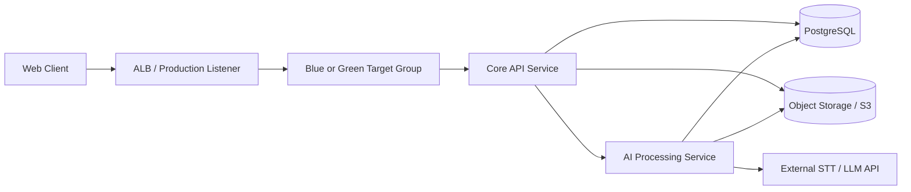

# 아키텍처 다이어그램 (AA)

## 구성 요소
- Web Client
- ALB + Production Listener
- Blue/Green Target Group
- Core API Service
- AI Processing Service
- DB(PostgreSQL)
- Object Storage(오디오/결과 파일)
- External STT/LLM API

## Mermaid Diagram

## 설계 원칙
- 외부 요청은 ALB Production Listener를 통해 현재 운영 Target Group으로만 전달한다
- Core API는 인증, 업로드 제어, 상태 관리, 조회를 담당한다
- AI Processing Service는 전사, 요약, 결정사항, To-Do 추출을 담당한다
- 원본 파일은 Object Storage에 저장하고 정형 데이터는 PostgreSQL에 저장한다

## 운영 고려 항목
- 외부 STT/LLM 제공자 확정
- 처리 실패 사유 코드 표준화
- 보관 기간 정책
