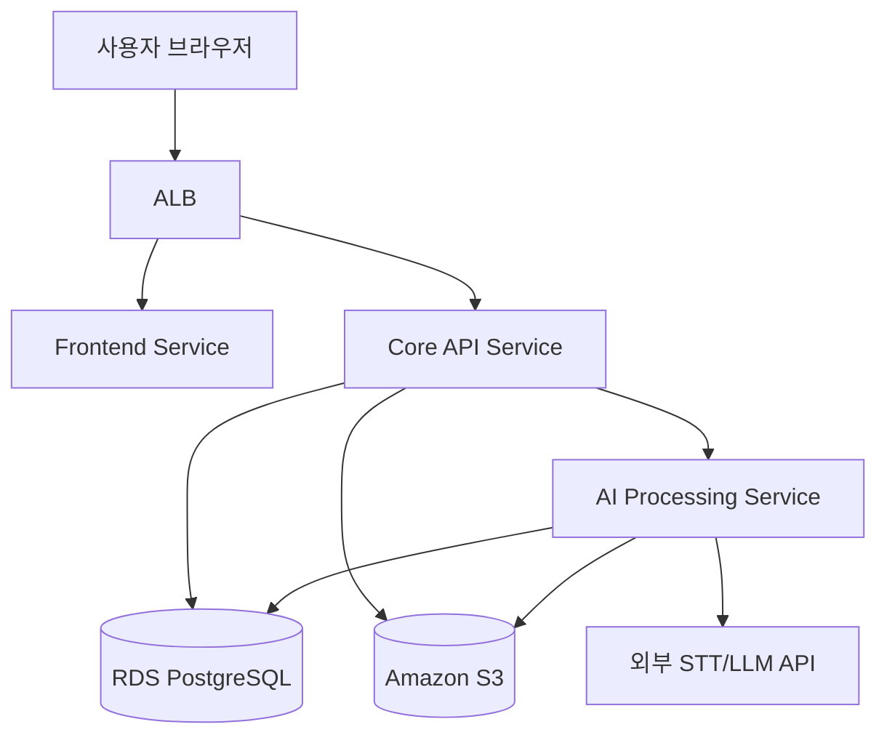

# 네트워크 구성도 (AA)

## 환경 구분
- Public Subnet: ALB 진입점
- Private Subnet: ECS 서비스, DB
- 외부 연동: STT/LLM API

## Mermaid Diagram

## 보안 기본 규칙
- DB는 Private 접근만 허용
- 서비스 간 통신은 최소 포트만 오픈
- 비밀키는 Secret Manager에 저장

## 운영 고려 항목
- 사내망/VPN 접근 정책
- 방화벽 인바운드 규칙
- 로그 수집 경로
