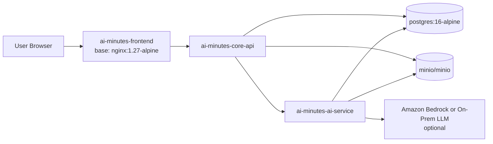

# 온프렘 최소 Docker 이미지 구성 및 상관관계

## 문서 목적
- 이 repo의 현재 산출물과 문서를 기준으로, 온프렘 환경 구축에 필요한 최소 Docker 이미지 집합을 정리한다.
- 각 이미지 간 호출/저장 관계를 Mermaid 다이어그램으로 명시한다.

## 판단 기준
- 실제 repo에서 확인된 Dockerfile: `frontend/Dockerfile`
- 문서에서 반복적으로 확인된 런타임 구성요소:
  - Frontend Service
  - Core API Service
  - AI Processing Service
  - PostgreSQL
  - Object Storage(S3 호환)
- `Queue(Redis 또는 메시지 큐)`는 문서에 있으나, 최소 온프렘 구성에서는 AI 처리 서비스를 동기 또는 자체 백그라운드 처리로 두는 전제하에 제외한다.

## 최소 이미지 집합

| 구분 | 이미지명 | 소스/근거 | 역할 | 최소 구성 포함 여부 |
|---|---|---|---|---|
| 사용자 정의 | `ai-minutes-frontend` | [`frontend/Dockerfile`](/home/xkak9/projects/AI-Minutes/frontend/Dockerfile) | 정적 웹 UI 제공 | 포함 |
| 사용자 정의 | `ai-minutes-core-api` | [`COMMON/role-allocation.md`](/home/xkak9/projects/AI-Minutes/COMMON/role-allocation.md) | 회의 생성, 상태 관리, 업로드/조회 API | 포함 |
| 사용자 정의 | `ai-minutes-ai-service` | [`COMMON/role-allocation.md`](/home/xkak9/projects/AI-Minutes/COMMON/role-allocation.md) | 전사/요약/할 일 추출 처리 | 포함 |
| 오픈소스 | `postgres:16-alpine` | [`COMMON/network-topology.md`](/home/xkak9/projects/AI-Minutes/COMMON/network-topology.md) | 업무 데이터 저장 | 포함 |
| 오픈소스 | `minio/minio` | [`AA/deployment-architecture.md`](/home/xkak9/projects/AI-Minutes/AA/deployment-architecture.md), [`COMMON/architecture-diagram.md`](/home/xkak9/projects/AI-Minutes/COMMON/architecture-diagram.md) | 온프렘 S3 호환 오브젝트 스토리지 | 포함 |

## 이미지별 설명

### 1. `ai-minutes-frontend`
- 현재 repo에서 실제 Dockerfile이 존재하는 유일한 애플리케이션 이미지다.
- 베이스 이미지는 `nginx:1.27-alpine`이다.
- 브라우저 요청을 받아 정적 HTML/JS/CSS를 제공하고, API는 Core API로 호출한다.

### 2. `ai-minutes-core-api`
- 이 repo에는 Dockerfile이 없지만, 역할 문서와 배포 문서에서 필수 서비스로 반복 등장한다.
- 최소 온프렘 구성에서는 다음 책임을 가진 독립 이미지로 보는 것이 맞다.
  - 회의 생성
  - 업로드 처리
  - 상태 전이 관리
  - 결과 조회
- DB와 오브젝트 스토리지에 직접 접근한다.

### 3. `ai-minutes-ai-service`
- 이 repo에는 Dockerfile이 없지만, AI Processing Service가 별도 서비스로 정의되어 있다.
- 최소 구성에서는 Worker 역할을 이 이미지에 통합하는 편이 가장 단순하다.
- Core API의 호출을 받아 전사/요약/액션 아이템 추출을 수행하고 결과를 DB/Object Storage에 반영한다.

### 4. `postgres:16-alpine`
- 문서상 DB는 PostgreSQL 전제다.
- 온프렘 최소 구성에서는 관리형 RDS 대신 컨테이너형 PostgreSQL로 치환한다.

### 5. `minio/minio`
- 문서상 S3/Object Storage가 필요하다.
- 온프렘 환경에서는 S3 대체로 MinIO가 가장 직접적인 선택이다.
- 업로드 오디오, 전사 결과 파일, 추후 내보내기 산출물을 저장하는 용도다.

## 최소 이미지 상관관계 다이어그램

## 구축 관점에서의 최소 연결 순서
1. 사용자는 `ai-minutes-frontend`에 접속한다.
2. 프론트엔드는 `ai-minutes-core-api`를 호출한다.
3. Core API는 메타데이터를 `postgres`에 저장하고, 오디오 파일을 `minio`에 저장한다.
4. Core API는 `ai-minutes-ai-service`에 전사/요약 처리를 요청한다.
5. AI Service는 처리 결과를 `postgres`와 `minio`에 반영한다.
6. 프론트엔드는 Core API를 통해 최종 결과를 조회한다.

## 최소 구성에서 제외한 이미지

| 이미지 | 제외 이유 |
|---|---|
| `redis` 또는 별도 메시지 큐 | 문서에는 존재하지만 현재 repo 기준 필수 런타임으로 확정되지는 않았음. 초기 온프렘은 AI 서비스 내부 백그라운드 처리로 단순화 가능 |
| 별도 Ingress Controller/Nginx Reverse Proxy | Kubernetes 배포 문서에는 존재하지만, Docker 단독 온프렘 최소 구성을 설명하는 문서이므로 제외 |
| 모니터링 스택(Prometheus, Grafana, Loki 등) | 운영상 권장되지만 최소 기능 구동에는 필수 아님 |

## 주의사항
- 현재 repo에서 실제 Dockerfile로 확인되는 것은 프론트엔드뿐이다.
- `ai-minutes-core-api`, `ai-minutes-ai-service`는 문서상 필수 이미지이며, 실제 온프렘 구축 전 해당 Dockerfile이 추가로 필요하다.
- AI 처리 대상이 Amazon Bedrock(클라우드) 기반이면 완전 폐쇄형 온프렘은 아니다. 완전 온프렘이 목표라면 STT/LLM까지 자체 호스팅 이미지로 별도 치환해야 한다.

- 코덱스 에이전트에 만들어달라고 한 프롬프트
