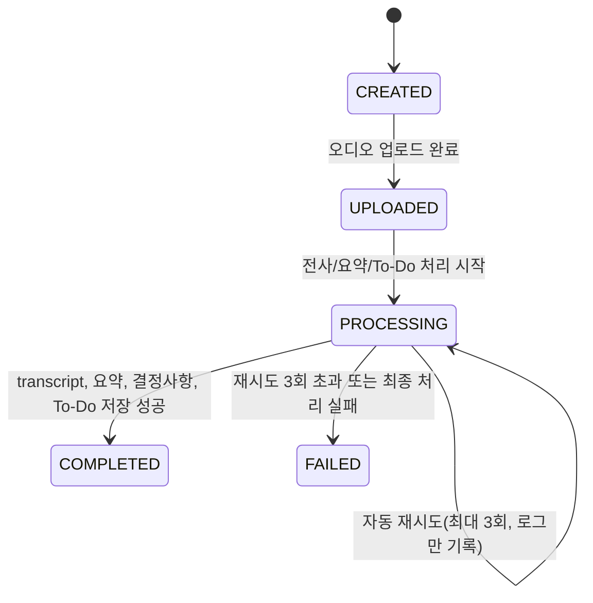

# 상태 흐름도 (AA)

## 회의 처리 상태
- CREATED
- UPLOADED
- PROCESSING
- COMPLETED
- FAILED

## Mermaid State Diagram

## 상태 전이 규칙
- 상태값은 현재 위치만 표현한다
- Retry는 별도 로그로 관리한다
- FAILED 상태에서는 실패 원인과 재시도 이력 저장이 필요하다
- COMPLETED 이후 수정은 재처리 작업으로만 허용
