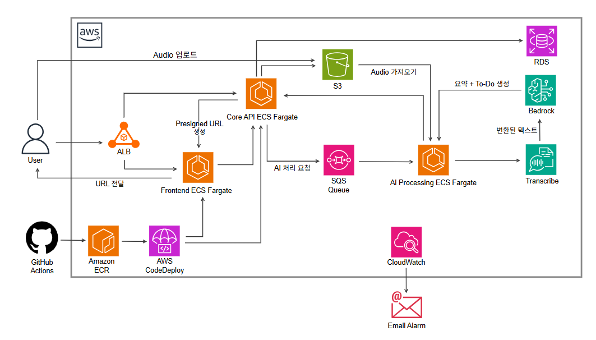

# AI Meeting Summary & To-Do Archive System (MeetUs)

> **담당 Read Me바로가기:** [AA (Frontend)](./AA/README.md) 

AI 기반으로 회의 음성 파일을 분석하여 **회의 요약과 개인별 To-Do를 자동 생성하고 아카이브하는 시스템**입니다.  

사용자는 회의 녹음 파일을 업로드하면  

음성 → 텍스트 변환(STT) → AI 요약 → 개인별 To-Do 추출  

과정을 거쳐 회의 기록을 자동으로 정리하고 관리할 수 있습니다.

본 프로젝트는 **AWS 기반 MSA 구조**, **Docker 컨테이너**, **CI/CD 자동 배포**, **Blue-Green / Rolling Update 배포 전략**을 적용하여 실제 서비스 운영 환경과 유사한 아키텍처를 목표로 설계되었습니다.

---

# 프로젝트 개요

| 항목 | 내용 |
|---|---|
| 프로젝트명 | AI Meeting Summary & To-Do Archive |
| 서비스명 | MeetUs |
| 기간 | 2주 |
| 인원 | 3명 |
| 아키텍처 | MSA 기반 서비스 분리 |
| 클라우드 | AWS |
| 컨테이너 | Docker |
| 배포 | ECS Fargate |
| CI/CD | GitHub Actions |
| 배포 전략 | Blue-Green (FE/BE), Rolling Update (SA) |

---

# 핵심 기능

## 1️⃣ 음성 파일 업로드
사용자가 회의 녹음 파일을 업로드하면 파일은 **AWS S3**에 저장됩니다.

## 2️⃣ 음성 → 텍스트 변환
업로드된 음성 파일은 **AWS Transcribe**를 통해 텍스트로 변환됩니다.

## 3️⃣ AI 회의 요약 생성
변환된 텍스트를 기반으로 **Amazon Bedrock (Claude 3.5 Sonnet)**을 이용해 회의 요약을 생성합니다.

## 4️⃣ 개인별 To-Do 자동 추출
회의 내용에서 **참여자별 해야 할 작업(To-Do)**을 AI가 자동으로 추출합니다.

## 5️⃣ 회의 기록 아카이브
생성된 회의 요약과 To-Do는 **RDS 데이터베이스에 저장**되어 언제든 조회할 수 있습니다.

---

# 전체 시스템 아키텍처

---

# 서비스 처리 흐름

1. 사용자가 회의 녹음 파일 업로드
2. Core API가 **S3 Presigned URL 발급**
3. 파일이 **S3에 업로드**
4. AI Processing Service가 S3에서 파일 읽기
5. **AWS Transcribe → 음성 텍스트 변환**
6. **Amazon Bedrock → 회의 요약 생성**
7. **Amazon Bedrock → 개인별 To-Do 추출**
8. 결과 데이터를 **RDS 저장**
9. 사용자는 아카이브 페이지에서 회의 기록 조회

---

# 기술 스택

## Frontend
- HTML
- CSS
- Vanilla JavaScript
- Nginx

## Backend
- Python

## AI
- Amazon Bedrock (Claude 3.5 Sonnet)
- AWS Transcribe

## Database
- AWS RDS

## Storage
- AWS S3

## Infrastructure
- AWS ECS (Fargate)
- Application Load Balancer
- CloudWatch

## DevOps
- Docker
- GitHub Actions
- AWS ECR
- CodeDeploy (FE/BE Blue-Green)
- Rolling Update (SA)
- OIDC (Keyless Auth)

---

# 역할 분담

## TA – Core API & Database → [상세 보기](./TA/README.md)

- Meeting 생성 API
- 상태 관리 API
- AI 처리 트리거
- DB 설계 및 관리
- Core API Docker 구성
- Core API CI/CD 구성

---

## SA – AI Processing Service → [상세 보기](./SA/README.md)

- AWS Transcribe(STT) 음성→텍스트 변환
- Amazon Bedrock (Claude 3.5 Sonnet) 요약 생성
- 개인별 To-Do 자동 추출 로직
- SQS 비동기 롱 폴링(Long Polling) 처리
- AI Service Docker 구성 (python:3.12-slim)
- AI Service CI/CD 구성 (OIDC + Rolling Update)

---

## AA – Frontend & Archive API → [상세 보기](./AA/README.md)

- 파일 업로드 UI
- 회의 상세 페이지
- To-Do 카드 UI
- Archive 조회 API
- Frontend Docker 구성
- Frontend CI/CD 구성

---

# DevOps 구성

## Docker

각 서비스는 독립적인 Docker 이미지로 구성됩니다.

- frontend Dockerfile
- core-api Dockerfile
- ai-service Dockerfile

Docker 이미지는 **AWS ECR**에 저장됩니다.

---

## CI/CD

GitHub Actions를 이용하여 자동 배포 파이프라인을 구성합니다.

1. 코드 Push
2. Docker Image Build
3. AWS ECR Push
4. ECS 서비스 업데이트
5. Blue-Green (FE/BE) / Rolling Update (SA) 배포

---

# 모니터링

운영 모니터링은 **AWS CloudWatch**를 사용합니다.

- 서비스 로그 수집
- 에러 로그 확인
- 서비스 상태 모니터링
- 장애 대응 알람

---

# 프로젝트 목표

본 프로젝트는 단순 기능 구현을 넘어서 다음을 목표로 합니다.

- AWS 기반 **MSA 아키텍처 경험**
- Docker 기반 **컨테이너 서비스 운영**
- GitHub Actions 기반 **CI/CD 자동화**
- ECS 기반 **클라우드 서비스 배포 경험**
- 실제 서비스 수준의 **아키텍처 설계 경험**

---

# 파트별 상세 문서

| 순서 | 파트 | 담당 | 바로가기 |
|:---:|---|---|---|
| 1 | **AA** – Frontend & UI | 선영 | [프론트엔드 발표 자료](./AA/README.md) |
| 2 | **TA** – Core API & Database | 단비 | [백엔드 발표 자료](./TA/README.md) |
| 3 | **SA** – AI Processing Pipeline | 주환 | [AI 파이프라인 발표 자료](./SA/README.md) |