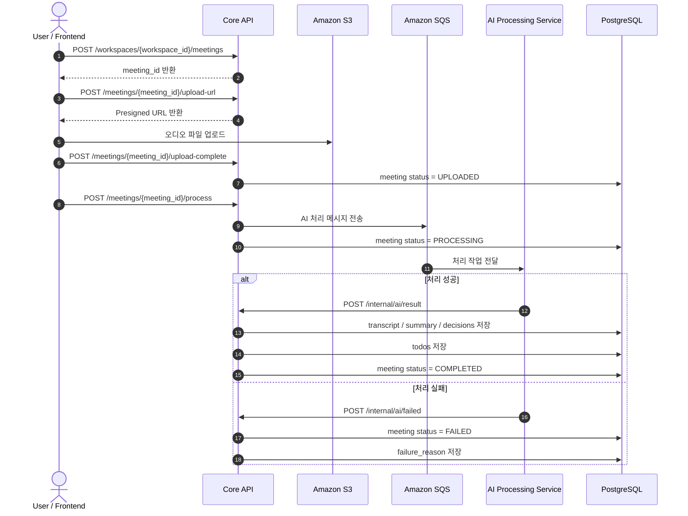

# TA Backend README

## 1. 개요

`TA`는 AI Minutes의 백엔드 영역을 담당한다. 현재 구현은 FastAPI 기반 Core API이며, 인증, 워크스페이스, 회의 생성/조회, 업로드 완료 처리, AI 결과 수신, To-Do 조회/상태 변경을 제공한다.

관련 코드와 배포 파일은 모두 [`backend`](../backend) 아래에 있다.

## 2. 백엔드 구성

주요 진입점과 라우터는 아래와 같다.

- 앱 진입점: [backend/app/main.py](../backend/app/main.py)
- 인증: [backend/app/routers/auth_router.py](../backend/app/routers/auth_router.py)
- 워크스페이스: [backend/app/routers/workspace_router.py](../backend/app/routers/workspace_router.py)
- 회의: [backend/app/routers/meeting_router.py](../backend/app/routers/meeting_router.py)
- 업로드 URL: [backend/app/routers/upload_router.py](../backend/app/routers/upload_router.py)
- To-Do: [backend/app/routers/todo_router.py](../backend/app/routers/todo_router.py)
- 내부 AI 콜백: [backend/app/routers/internal_router.py](../backend/app/routers/internal_router.py)
- DB 연결: [backend/app/database.py](../backend/app/database.py)

## 3. 기술 스택

### 3.1 백엔드

<strong>Python 3.12</strong> 백엔드 API의 주요 구현 언어다.

<strong>FastAPI</strong> REST API 구현과 요청 검증, Swagger 문서 제공에 사용된다.

<strong>Pydantic</strong> 요청/응답 스키마 검증과 직렬화에 사용된다.

<strong>Uvicorn</strong> 로컬 실행과 컨테이너 구동 시 사용하는 ASGI 서버다.

### 3.2 데이터 계층

<strong>SQLAlchemy</strong> ORM 모델 정의와 세션 관리, DB CRUD 처리에 사용된다.

<strong>PostgreSQL</strong> `DATABASE_URL` 기반 관계형 데이터 저장소로 사용된다.

<strong>SQL Migration</strong> 스키마 변경 이력을 `backend/migrations`의 SQL 파일로 관리한다.

### 3.3 인증 및 보안

<strong>JWT</strong> 로그인 이후 사용자 인증 정보를 전달하는 데 사용된다.

<strong>SHA-256 비밀번호 해시</strong> 회원가입과 로그인 검증에 사용된다.

<strong>CORS</strong> 허용 Origin 제어를 위해 FastAPI 미들웨어로 적용된다.

### 3.4 스토리지 및 외부 연동

<strong>Amazon S3</strong> 회의 오디오 파일 저장소로 사용된다.

<strong>Boto3</strong> S3 Presigned URL 생성과 SQS 메시지 전송에 사용된다.

<strong>Amazon SQS</strong> AI 처리 요청을 비동기로 전달하는 큐로 사용된다.

<strong>내부 AI Callback API</strong>는 AI 처리 결과와 실패 정보를 수신하는 엔드포인트다.

### 3.5 배포 및 인프라

<strong>Docker</strong> 백엔드 애플리케이션을 컨테이너 이미지로 패키징하는 데 사용된다.

<strong>Amazon ECR</strong> 백엔드 Docker 이미지를 저장하는 레지스트리로 사용된다.

<strong>Amazon ECS</strong> 백엔드 Core API 컨테이너 실행 환경으로 사용된다.

<strong>AWS CodeDeploy</strong> ECS 배포 전환과 새 태스크 반영에 사용된다.

<strong>Application Load Balancer</strong> 백엔드 서비스의 외부 진입점으로 사용된다.

<strong>CloudWatch Logs</strong> 컨테이너 로그 수집에 사용된다.

### 3.6 빌드 및 자동화

<strong>GitHub Actions</strong> 백엔드 CI/CD 자동화에 사용된다.

<strong>OIDC 기반 AWS 인증</strong>은 GitHub Actions의 AWS 역할 연동에 사용된다.

<strong>JQ / Sed</strong> 배포 템플릿 치환과 설정값 반영에 사용된다.

의존성 목록은 [backend/requirements.txt](../backend/requirements.txt)에 정리되어 있다.

## 4. 로컬 실행

### 4.1 필수 환경 변수

- `DATABASE_URL`
- `JWT_SECRET`
- `CORS_ALLOW_ORIGINS`
- `AWS_REGION`
- `SQS_QUEUE_URL`
- S3 Presigned URL 생성에 필요한 AWS 자격 증명

`DATABASE_URL`은 필수다. `JWT_SECRET`은 없으면 개발용 기본값 `dev-secret`을 사용한다.

### 4.2 실행 방법

```bash
cd backend
python -m venv .venv
.venv\Scripts\activate
pip install -r requirements.txt
uvicorn app.main:app --reload
```

실행 후 기본 진입점은 아래와 같다.

- API: `http://127.0.0.1:8000`
- Swagger: `http://127.0.0.1:8000/docs`

## 5. 데이터베이스

- SQLAlchemy 엔진은 `DATABASE_URL`로 생성한다.
- [`backend/app/main.py`](../backend/app/main.py)에서 `init_db()`를 통해 모델 기준 테이블 생성이 가능하다.
- 스키마 변경 이력은 [`backend/migrations`](../backend/migrations)에 SQL 파일로 관리한다.

관련 문서:

- [TA/database-design.md](./database-design.md)
- [backend/migrations/2026-03-09_ta_spec_alignment.sql](../backend/migrations/2026-03-09_ta_spec_alignment.sql)
- [backend/migrations/2026-03-11_meeting_failure_reason.sql](../backend/migrations/2026-03-11_meeting_failure_reason.sql)

## 6. 주요 API

현재 구현 기준 주요 엔드포인트는 아래와 같다.

### 6.1 Auth

- `POST /auth/signup`
- `POST /auth/login`

### 6.2 Workspaces

- `POST /workspaces`
- `GET /workspaces`
- `POST /workspaces/{workspace_id}/invite`
- `GET /workspaces/{workspace_id}/members`
- `POST /workspaces/{workspace_id}/leave`
- `DELETE /workspaces/{workspace_id}`
- `POST /workspaces/{workspace_id}/meetings`

### 6.3 Meetings

- `POST /meetings/{meeting_id}/upload-url`
- `POST /meetings/{meeting_id}/upload-complete`
- `GET /meetings`
- `GET /meetings/{meeting_id}`
- `POST /meetings/{meeting_id}/process`
- `POST /meetings/{meeting_id}/retry`
- `DELETE /meetings/{meeting_id}`

### 6.4 Upload

- `POST /upload/url`

### 6.5 Todos

- `GET /todos`
- `PATCH /todos/{todo_id}`

### 6.6 Internal

- `POST /internal/ai/result`
- `POST /internal/ai/failed`

상세 요청/응답 규격은 [TA/api-spec.md](./api-spec.md)를 기준으로 본다.

## 7. 회의 상태값

백엔드에서 사용하는 회의 상태값은 아래와 같다.

| 상태         | 의미                      |
| ------------ | ------------------------- |
| `CREATED`    | 회의 메타데이터 생성 완료 |
| `UPLOADED`   | 오디오 업로드 완료        |
| `PROCESSING` | AI 처리 진행 중           |
| `COMPLETED`  | 결과 저장 완료            |
| `FAILED`     | AI 처리 실패              |

상태 enum은 [backend/app/enums/meeting_status.py](../backend/app/enums/meeting_status.py)에 있다.

## 8. AI 처리 흐름



처리 흐름은 다음과 같다. 사용자가 먼저 워크스페이스에 회의를 생성하면 백엔드는 `meeting_id`를 만든다. 이후 사용자는 업로드 URL 발급 API를 호출하고, 백엔드는 S3 Presigned URL을 반환한다.

사용자가 오디오 파일을 S3에 업로드한 뒤 업로드 완료 API를 호출하면, 백엔드는 해당 회의 상태를 `UPLOADED`로 변경한다. 그다음 사용자가 처리 시작 API를 호출하면 백엔드는 SQS에 AI 처리 메시지를 넣고 회의 상태를 `PROCESSING`으로 변경한다.

AI 처리 서비스는 SQS 메시지를 읽어 전사, 요약, 결정사항, To-Do를 생성한다. 처리에 성공하면 내부 결과 API를 호출하고, 백엔드는 결과 데이터를 DB에 저장한 뒤 상태를 `COMPLETED`로 바꾼다. 처리에 실패하면 실패 API를 호출하고, 백엔드는 상태를 `FAILED`로 변경하면서 실패 사유를 함께 저장한다.

## 9. 배포

백엔드 배포는 `ECR + ECS Fargate + CodeDeploy` 기준으로 구성되어 있다.

### 9.1 사전 준비

- AWS CLI 설치 및 인증
- Docker 설치
- ECR 리포지토리 생성
- ECS Cluster / Service 준비
- CodeDeploy Application / Deployment Group 준비
- GitHub Actions OIDC Role 준비

### 9.2 이미지 빌드 / 푸시

예시:

```bash
aws ecr get-login-password --region ap-northeast-2 | docker login --username AWS --password-stdin <account-id>.dkr.ecr.ap-northeast-2.amazonaws.com
docker build -t ai-minutes-core-api:latest ./backend
docker tag ai-minutes-core-api:latest <account-id>.dkr.ecr.ap-northeast-2.amazonaws.com/ai-minutes-core-api:latest
docker push <account-id>.dkr.ecr.ap-northeast-2.amazonaws.com/ai-minutes-core-api:latest
```

### 9.3 값 수정 포인트

- [backend/deploy/taskdef-core-api.template.json](../backend/deploy/taskdef-core-api.template.json)의 이미지 경로
- [backend/deploy/taskdef-core-api.template.json](../backend/deploy/taskdef-core-api.template.json)의 환경 변수
- [backend/deploy/taskdef-core-api.template.json](../backend/deploy/taskdef-core-api.template.json)의 IAM Role, 로그 그룹, 헬스체크
- [backend/deploy/appspec-core-api.yaml](../backend/deploy/appspec-core-api.yaml)의 `ContainerName`, `ContainerPort`
- [.github/workflows/backend.yml](../.github/workflows/backend.yml)의 ECR / ECS / CodeDeploy 변수와 GitHub Secret

### 9.4 수동 배포 흐름

1. Docker 이미지를 빌드하고 ECR에 push 한다.
2. `taskdef-core-api.template.json`을 기준으로 새 Task Definition을 생성한다.
3. `appspec-core-api.yaml`에 새 Task Definition ARN을 반영한다.
4. CodeDeploy로 ECS 배포를 생성한다.
5. 배포 후 ECS 서비스 상태와 ALB 응답을 확인한다.

### 9.5 GitHub Actions 배포

이 저장소는 백엔드 배포용 GitHub Actions 워크플로를 사용한다.

- 워크플로 파일: [.github/workflows/backend.yml](../.github/workflows/backend.yml)
- Dockerfile: [backend/Dockerfile](../backend/Dockerfile)
- Task definition template: [backend/deploy/taskdef-core-api.template.json](../backend/deploy/taskdef-core-api.template.json)
- AppSpec template: [backend/deploy/appspec-core-api.yaml](../backend/deploy/appspec-core-api.yaml)

워크플로 흐름은 다음과 같다.

1. `main` 브랜치에 `backend/**` 변경이 반영되면 `backend-ci-cd`가 실행된다.
2. GitHub Actions가 OIDC로 AWS Role을 Assume 한다.
3. Docker 이미지를 빌드하고 ECR에 push 한다.
4. Task Definition 템플릿에 새 이미지 URI를 반영한다.
5. ECS Task Definition을 등록한다.
6. AppSpec을 렌더링한 뒤 CodeDeploy 배포를 생성한다.

### 9.6 배포 확인

예시:

```bash
aws ecs describe-services --cluster ai-minutes-cluster --services ai-minutes-core-api-codedeploy-service --region ap-northeast-2
aws deploy list-deployments --application-name ai-minutes-backend-codedeploy-app --deployment-group-name ai-minutes-backend-deployment-group --region ap-northeast-2
```

배포 증적 문서:

- [TA/aws-deploy-evidence-2026-03-09.md](./aws-deploy-evidence-2026-03-09.md)
- [TA/aws-deploy-evidence-2026-03-11.md](./aws-deploy-evidence-2026-03-11.md)
- [TA/aws-deploy-evidence-2026-03-12.md](./aws-deploy-evidence-2026-03-12.md)

## 10. 참고

- 통합 API 문서: [COMMON/api-specification-integrated.md](../COMMON/api-specification-integrated.md)
- 상태 흐름도: [COMMON/state-flow-diagram.md](../COMMON/state-flow-diagram.md)
- CI/CD 흐름: [COMMON/ci-cd-flow.md](../COMMON/ci-cd-flow.md)
