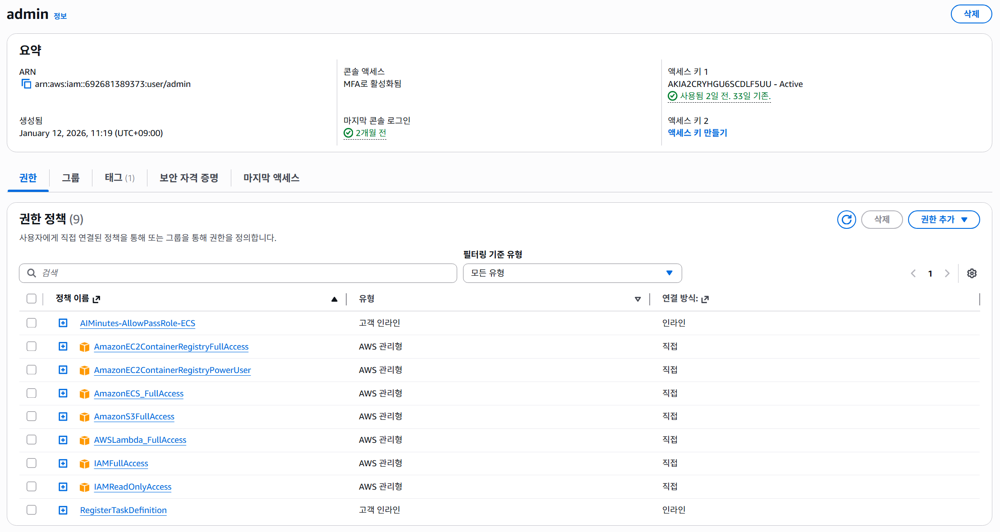
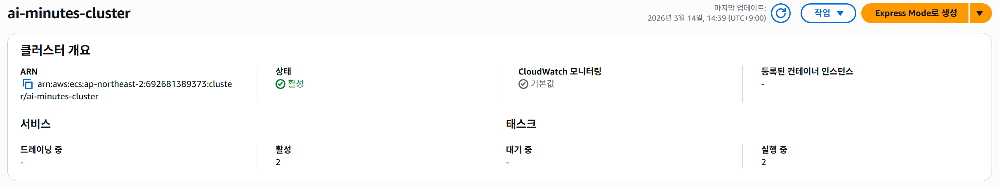

# AWS 배포 작업 증적 (TA Backend)

- 작성일: 2026-03-09
- 작성자: TA(Backend)
- 범위: `AI-Minutes/backend` Core API 컨테이너화 및 ECS 배포 준비/진행 증적

## 1) 작업 목적

- TA 백엔드(Core API)를 Docker 이미지로 빌드
- ECR 업로드
- ECS 클러스터/태스크 정의 등록 및 서비스 생성 준비
- ALB 연동 기반 서비스 배포 진행

## 2) 환경 정보

- 로컬 경로: `C:\workspace\4th-project\AI-Minutes\backend`
- Docker: `Docker version 28.5.1, build e180ab8`
- AWS 리전: `ap-northeast-2`
- AWS 계정: `692681389373`
- ECS 클러스터: `ai-minutes-cluster`
- Task Definition Family: `ai-minutes-core-api-task`
- ECR Repository: `ai-minutes-core-api`

## 3) 주요 증적 (터미널 로그 기반)

### 3.1 Docker 빌드 성공

```powershell
docker build -t ai-minutes-core-api:latest .
```

- 결과: `FINISHED`
- 이미지명: `ai-minutes-core-api:latest`

### 3.2 .env 포맷 오류 확인 및 원인 파악

```text
docker: invalid env file (.env): variable 'DATABASE_URL ' contains whitespaces
```

- 원인: `.env` 첫 줄 `DATABASE_URL = ...` (등호 양쪽 공백)
- 조치: `DATABASE_URL=...` 형태로 수정 필요 확인

### 3.3 AWS CLI 권한 오류 확인

초기 조회 시:

```text
AccessDeniedException: not authorized to perform ecs:ListClusters
AccessDeniedException: not authorized to perform ecs:ListServices
```

- 의미: IAM 사용자 권한 부족 상태 확인

### 3.4 ECS 클러스터 생성 성공

```powershell
aws ecs create-cluster --cluster-name ai-minutes-cluster --region ap-northeast-2
```

- 결과: `status: ACTIVE`
- ARN: `arn:aws:ecs:ap-northeast-2:692681389373:cluster/ai-minutes-cluster`

### 3.5 클러스터 조회 성공

```powershell
aws ecs list-clusters --region ap-northeast-2
```

- 결과: `ai-minutes-cluster` ARN 반환

### 3.6 Task Definition 등록 성공

```powershell
aws ecs register-task-definition --cli-input-json file://deploy/taskdef-core-api.template.json --region ap-northeast-2
```

- 결과: `task-definition/ai-minutes-core-api-task:1` 생성
- 컨테이너: `core-api`
- 이미지: `692681389373.dkr.ecr.ap-northeast-2.amazonaws.com/ai-minutes-core-api:latest`

### 3.7 ECR Push 성공

```powershell
docker push 692681389373.dkr.ecr.ap-northeast-2.amazonaws.com/ai-minutes-core-api:latest
```

- 결과: 레이어 푸시 완료
- Digest: `sha256:56a91c20fb362c0e6934ecb7d511cbeeefc773b5fe533afc6c6ad6431f961448`

## 4) IAM 권한 관련 증적



- `iam:PassRole` 인라인 정책 생성 확인
  - 정책명: `AIMinutes-AllowPassRole-ECS`
  - 대상 Role:
    - `arn:aws:iam::692681389373:role/ecsTaskExecutionRole`
    - `arn:aws:iam::692681389373:role/ai-minutes-core-api-task-role`
- ECS/ECR 작업을 위한 정책 부여 진행 확인
  - `AmazonECS_FullAccess`
  - `AmazonEC2ContainerRegistryPowerUser`

## 5) ECS 서비스 생성 화면 설정 증적 (콘솔)



- Cluster: `ai-minutes-cluster`
- Launch type: `FARGATE`
- Desired tasks: `1`
- Deployment strategy: `롤링 업데이트`
- Circuit breaker + rollback: 활성화
- Load Balancer: `Application Load Balancer`
- Container mapping: `core-api:8000`
- Target Group:
  - 포트 `8000`
  - Health Check Path `/docs`

네트워킹 이슈 확인:

- 동일 AZ(`ap-northeast-2a`) 서브넷 2개 선택 시 오류 발생 확인
- 조치: AZ 중복 없이 서브넷 재선택 필요

## 6) 민감정보 처리 메모

- 작업 중 `DATABASE_URL`, AWS Access Key, JWT Secret 등의 민감값이 로컬/콘솔 입력에 사용됨
- 공개 문서/커밋에는 민감값 마스킹 또는 시크릿 매니저 이전 필요

## 7) 현재 상태 요약

- Docker 빌드: 완료
- ECR Push: 완료
- ECS 클러스터 생성: 완료
- Task Definition 등록: 완료
- ECS 서비스 생성: 진행 중 (네트워킹/ALB 설정 최종 확인 단계)
