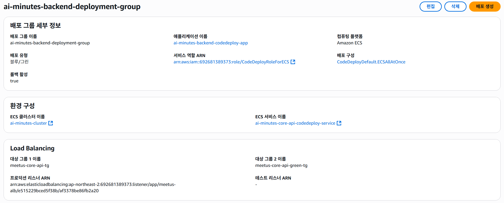

# AWS 배포 작업 증적 (TA Backend) - 블루/그린 전환 준비

- 작성일: 2026-03-12
- 작성자: TA(Backend)
- 범위: `AI-Minutes/backend` Core API의 ECS rolling update 배포를 CodeDeploy 기반 blue/green 배포로 전환하기 위한 설정 및 검증
- 선행 문서:
  - `TA/aws-deploy-evidence-2026-03-09.md`
  - `TA/aws-deploy-evidence-2026-03-11.md`

## 1) 작업 목적

- 기존 ECS rolling update 방식에서 CodeDeploy 기반 blue/green 배포 방식으로 전환
- 배포 시 새 task definition revision을 등록하고, CodeDeploy가 blue/green target group 간 트래픽을 전환하도록 변경
- GitHub Actions backend 배포 워크플로를 CodeDeploy 배포 생성 방식으로 수정

## 2) 코드/배포 파일 변경 증적

### 2.1 GitHub Actions backend 워크플로 수정

- 대상 파일: `.github/workflows/backend.yml`
- 변경 내용:
  - ECS 직접 배포(`aws ecs update-service`) 제거
  - task definition 렌더링 단계 추가
  - `aws ecs register-task-definition` 단계 추가
  - `backend/deploy/appspec-core-api.yaml` 기반 AppSpec 렌더링 단계 추가
  - `aws deploy create-deployment` 단계 추가
  - CodeDeploy application / deployment group 이름을 workflow env로 고정:
    - `ai-minutes-backend-codedeploy-app`
    - `ai-minutes-backend-deployment-group`

### 2.2 백엔드 배포 템플릿 확인

- 대상 파일:
  - `backend/deploy/taskdef-core-api.template.json`
  - `backend/deploy/appspec-core-api.yaml`
- 확인 내용:
  - 컨테이너명 `core-api`
  - 컨테이너 포트 `8000`
  - AppSpec placeholder `<TASK_DEFINITION>` 사용
  - CORS 허용 origin 값은 신규 프론트 ALB 주소로 유지

## 3) IAM / GitHub Actions 권한 이슈 확인

### 3.1 GitHub Actions 실패 로그 확인

- `Register ECS task definition` 단계에서 아래 권한 부족 오류 확인:

```text
AccessDeniedException: not authorized to perform ecs:RegisterTaskDefinition
```

- 조치:
  - GitHub Actions role `GitHubActions-TA-BackendDeploy`에 `ecs:RegisterTaskDefinition` 권한 추가 필요 확인

### 3.2 추가 PassRole 오류 확인

- 이후 같은 단계에서 아래 권한 부족 오류 확인:

```text
AccessDeniedException: not authorized to perform iam:PassRole
on resource arn:aws:iam::692681389373:role/ai-minutes-core-api-task-role
```

- 조치:
  - `iam:PassRole` 대상 role 확인:
    - `arn:aws:iam::692681389373:role/ecsTaskExecutionRole`
    - `arn:aws:iam::692681389373:role/ai-minutes-core-api-task-role`

## 4) CodeDeploy 리소스 생성 증적



### 4.1 CodeDeploy Application 생성

- 이름: `ai-minutes-backend-codedeploy-app`
- 컴퓨팅 플랫폼: `Amazon ECS`

### 4.2 CodeDeploy 서비스 역할 생성

- 역할명: `CodeDeployRoleForECS`
- 연결 정책: `AWSCodeDeployRoleForECS`

### 4.3 Green target group 생성

- 이름: `meetus-core-api-green-tg`
- 대상 유형: `IP`
- 프로토콜/포트: `HTTP:8000`
- VPC: `vpc-0ff95fed577b6ba3d`
- 상태 검사 경로: `/docs`
- 상태 검사 포트: `traffic-port`
- 생성 시점에는 대상 미등록 상태로 유지

### 4.4 CodeDeploy용 ECS 서비스 신규 생성

- 기존 rolling update 서비스:
  - `ai-minutes-core-api-service`
- 신규 CodeDeploy 서비스:
  - `ai-minutes-core-api-codedeploy-service`

- 생성 명령 실행:

```powershell
aws ecs create-service `
  --cluster ai-minutes-cluster `
  --service-name ai-minutes-core-api-codedeploy-service `
  --task-definition ai-minutes-core-api-task:2 `
  --desired-count 1 `
  --launch-type FARGATE `
  --deployment-controller type=CODE_DEPLOY `
  --load-balancers "targetGroupArn=arn:aws:elasticloadbalancing:ap-northeast-2:692681389373:targetgroup/meetus-core-api-tg/04106226faefaa76,containerName=core-api,containerPort=8000" `
  --network-configuration "awsvpcConfiguration={subnets=[subnet-000d0cd4984fc695f,subnet-08313de4d92e33a50],securityGroups=[sg-025400a8c8b50c4de],assignPublicIp=DISABLED}" `
  --platform-version LATEST `
  --health-check-grace-period-seconds 120 `
  --region ap-northeast-2
```

- 생성 결과 확인:
  - `serviceName`: `ai-minutes-core-api-codedeploy-service`
  - `deploymentController`: `CODE_DEPLOY`
  - `launchType`: `FARGATE`

### 4.5 CodeDeploy Deployment Group 생성

- 이름: `ai-minutes-backend-deployment-group`
- application: `ai-minutes-backend-codedeploy-app`
- ECS cluster: `ai-minutes-cluster`
- ECS service: `ai-minutes-core-api-codedeploy-service`
- 로드 밸런서: `meetus-alb`
- 프로덕션 리스너: `HTTP:80`
- 테스트 리스너: 미사용
- 대상 그룹:
  - blue: `meetus-core-api-tg`
  - green: `meetus-core-api-green-tg`
- 배포 구성: `CodeDeployDefault.ECSAllAtOnce`
- 롤백: 활성화

## 5) 확인된 AWS 식별자

- VPC:
  - `vpc-0ff95fed577b6ba3d`
- 서브넷:
  - `subnet-000d0cd4984fc695f`
  - `subnet-08313de4d92e33a50`
- ECS task security group:
  - `sg-025400a8c8b50c4de`
- production target group ARN:
  - `arn:aws:elasticloadbalancing:ap-northeast-2:692681389373:targetgroup/meetus-core-api-tg/04106226faefaa76`

## 6) 진행 중 확인 사항

- 기존 GitHub Actions role에 CodeDeploy 호출 권한 추가 필요:
  - `codedeploy:CreateDeployment`
  - `codedeploy:GetDeployment`
  - `codedeploy:GetDeploymentGroup`
- backend workflow를 `main` 반영 후 실제 CodeDeploy 배포 생성 성공 여부 추가 확인 필요
- 신규 CodeDeploy 서비스가 실제 배포 시 blue/green target group 전환을 정상 수행하는지 후속 검증 필요

## 7) GitHub Actions IAM 정책 통합안

- 대상 role:
  - `GitHubActions-TA-BackendDeploy`
- 목적:
  - 기존 분산된 inline policy(`TA-BackendDeployPolicy`, `RegisterTaskDefinition`, `PassRole`)를 단일 정책으로 정리
  - backend blue/green workflow 수행에 필요한 ECR / ECS / PassRole / CodeDeploy 권한을 한 번에 관리

```json
{
  "Version": "2012-10-17",
  "Statement": [
    {
      "Sid": "EcrAuth",
      "Effect": "Allow",
      "Action": ["ecr:GetAuthorizationToken"],
      "Resource": "*"
    },
    {
      "Sid": "EcrPush",
      "Effect": "Allow",
      "Action": [
        "ecr:BatchCheckLayerAvailability",
        "ecr:CompleteLayerUpload",
        "ecr:DescribeRepositories",
        "ecr:InitiateLayerUpload",
        "ecr:PutImage",
        "ecr:UploadLayerPart"
      ],
      "Resource": "arn:aws:ecr:ap-northeast-2:692681389373:repository/ai-minutes-core-api"
    },
    {
      "Sid": "EcsReadAndDeploy",
      "Effect": "Allow",
      "Action": [
        "ecs:UpdateService",
        "ecs:DescribeServices",
        "ecs:RegisterTaskDefinition"
      ],
      "Resource": "*"
    },
    {
      "Sid": "AllowPassEcsTaskRoles",
      "Effect": "Allow",
      "Action": "iam:PassRole",
      "Resource": [
        "arn:aws:iam::692681389373:role/ecsTaskExecutionRole",
        "arn:aws:iam::692681389373:role/ai-minutes-core-api-task-role"
      ]
    },
    {
      "Sid": "CodeDeployBlueGreen",
      "Effect": "Allow",
      "Action": [
        "codedeploy:CreateDeployment",
        "codedeploy:GetDeployment",
        "codedeploy:GetDeploymentGroup"
      ],
      "Resource": "*"
    }
  ]
}
```

## 8) 현재 상태 요약

- backend blue/green용 CodeDeploy application 생성 완료
- backend blue/green용 deployment group 생성 완료
- green target group 생성 완료
- CodeDeploy controller 기반 ECS 서비스 생성 완료
- backend GitHub Actions workflow를 CodeDeploy 배포 생성 방식으로 수정 완료
- IAM 권한 보강 및 실제 Actions 배포 성공 여부는 후속 확인 단계로 남음

## 9) 재구성 및 재시도 증적

### 9.1 1차 CodeDeploy 배포 실패 확인

- 최초 blue/green 배포 ID:
  - `d-Y9JL7QFEH`
- 증상:
  - CodeDeploy 배포가 50%에서 장시간 정체
  - 대체 작업 세트가 트래픽을 받지 못함
- ECS 서비스 이벤트 확인 결과:

```text
ResourceInitializationError: unable to pull secrets or registry auth
The task cannot pull registry auth from Amazon ECR
GetAuthorizationToken ... i/o timeout
```

- 해석:
  - green task set이 ECR 인증 토큰을 가져오지 못해 컨테이너 이미지를 pull하지 못함
  - 그 결과 대체 작업 세트가 정상 기동하지 못해 CodeDeploy 배포가 진행 중 정체

### 9.2 자동 롤백 확인

- 자동 롤백 배포 ID:
  - `d-7VN9RPGEH`
- 확인 내용:
  - CodeDeploy가 실패한 배포 `d-Y9JL7QFEH`에 대해 자동 롤백 수행
  - 원래 작업 세트로 트래픽 100% 복구
- 배포 상세 문구:

```text
This is a rollback deployment triggered automatically
to roll back the deployment d-Y9JL7QFEH
```

### 9.3 CodeDeploy 리소스 정리 및 재생성

- 1차 시도 실패 후 수행한 정리:
  - CodeDeploy application `ai-minutes-backend-codedeploy-app` 삭제
  - CodeDeploy 전용 ECS 서비스 `ai-minutes-core-api-codedeploy-service` 삭제
  - green target group `meetus-core-api-green-tg` 삭제

- 이후 재생성:
  - green target group `meetus-core-api-green-tg` 재생성
  - CodeDeploy application `ai-minutes-backend-codedeploy-app` 재생성
  - CodeDeploy deployment group `ai-minutes-backend-deployment-group` 재생성

### 9.4 CodeDeploy 전용 ECS 서비스 재생성

- 재생성 서비스:
  - `ai-minutes-core-api-codedeploy-service`
- 사용 task definition revision:
  - `ai-minutes-core-api-task:10`
- 재생성 시 네트워크 설정:
  - subnets:
    - `subnet-000d0cd4984fc695f`
    - `subnet-08313de4d92e33a50`
  - security group:
    - `sg-025400a8c8b50c4de`
  - `assignPublicIp=ENABLED`

- 사용 명령:

```powershell
aws ecs create-service `
  --cluster ai-minutes-cluster `
  --service-name ai-minutes-core-api-codedeploy-service `
  --task-definition ai-minutes-core-api-task:10 `
  --desired-count 1 `
  --launch-type FARGATE `
  --deployment-controller type=CODE_DEPLOY `
  --load-balancers "targetGroupArn=arn:aws:elasticloadbalancing:ap-northeast-2:692681389373:targetgroup/meetus-core-api-tg/04106226faefaa76,containerName=core-api,containerPort=8000" `
  --network-configuration "awsvpcConfiguration={subnets=[subnet-000d0cd4984fc695f,subnet-08313de4d92e33a50],securityGroups=[sg-025400a8c8b50c4de],assignPublicIp=ENABLED}" `
  --platform-version LATEST `
  --health-check-grace-period-seconds 120 `
  --region ap-northeast-2
```

- 재생성 후 ECS 이벤트 확인:
  - task 시작 성공
  - `meetus-core-api-tg`에 대상 등록 성공
  - service `STEADY_STATE` 도달

### 9.5 GitHub Actions IAM 권한 추가 보강

- backend workflow 재실행 중 순차적으로 확인된 CodeDeploy 권한 부족:
  - `codedeploy:CreateDeployment`
  - `codedeploy:GetDeploymentConfig`
  - `codedeploy:RegisterApplicationRevision`

- 최종적으로 GitHub Actions role `GitHubActions-TA-BackendDeploy`에 CodeDeploy 권한을 포함한 단일 정책 적용

## 10) 최종 blue/green 배포 진행 증적

- 재시도 배포 ID:
  - `d-YN2J2JHEH`
- 확인 시점 상태:
  - 1단계 `대체 작업 세트 배포`: 성공
  - 2단계 `프로덕션 트래픽 전환`: 성공
  - 대체 작업 세트 트래픽: `100%`
  - 원본 작업 세트 트래픽: `0%`
  - 3단계 `5분 대기`: 진행 중
  - 4단계 `원래 작업 세트 종료`: 대기 중

- 해석:
  - blue/green 배포 자체는 정상 흐름으로 진입
  - 대체 작업 세트가 정상 기동 및 트래픽 전환까지 완료
  - 남은 단계는 대기 후 원래 작업 세트 종료 처리

## 11) 최종 상태 요약 (2026-03-12 추가 반영)

- backend GitHub Actions workflow:
  - CodeDeploy blue/green 배포 생성 방식으로 수정 완료
- CodeDeploy application:
  - 재생성 완료
- CodeDeploy deployment group:
  - 재생성 완료
- green target group:
  - 재생성 완료
- CodeDeploy 전용 ECS 서비스:
  - 재생성 완료 및 steady state 확인
- GitHub Actions IAM 권한:
  - ECR / ECS / PassRole / CodeDeploy 권한까지 통합 보강
- blue/green 배포:
  - 대체 작업 세트 기동 및 트래픽 전환 성공 확인
  - 최종 종료 단계만 남은 상태로 확인
