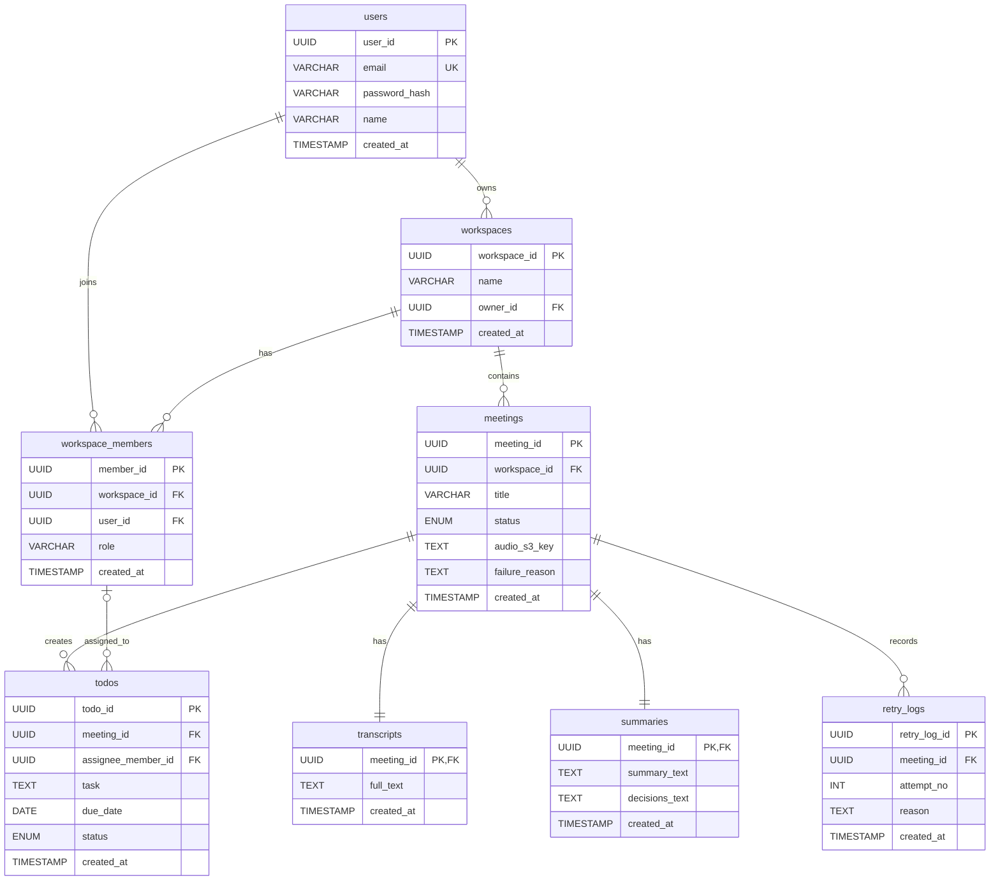

# Core DB ERD

`TA/database-design.md` 기준으로 핵심 테이블만 추린 Mermaid ERD 문서입니다.

## Notes

- `workspace_members`는 `UNIQUE (workspace_id, user_id)` 제약으로 워크스페이스 내 사용자 중복을 방지한다.
- `meetings.status`는 `CREATED`, `UPLOADED`, `PROCESSING`, `COMPLETED`, `FAILED` 값을 사용한다.
- `todos.status`는 `PENDING`, `IN_PROGRESS`, `DONE` 값을 사용한다.
- `transcripts`, `summaries`는 `meetings`와 1:1 구조다.
- `todos.assignee_member_id`는 NULL 가능하며, 담당자 매핑 실패 시 비어 있을 수 있다.
