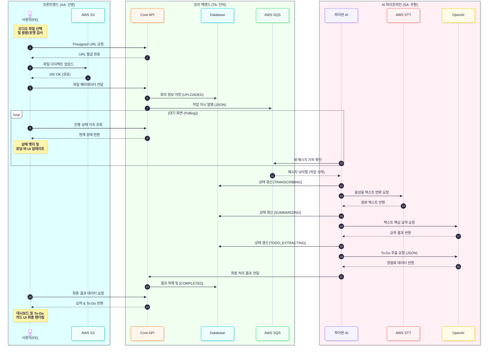

# 🏗️ 시스템 아키텍처 및 데이터 흐름 (System Architecture)

## 1. 비동기 이벤트 기반 파이프라인 (Event-Driven Architecture)
AI 처리(STT 및 LLM)는 짧게는 수십 초에서 길게는 수 분이 걸리는 무거운 작업입니다. HTTP 동기 통신 시 발생하는 타임아웃(Timeout) 및 서버 부하를 방지하기 위해 **AWS SQS를 활용한 비동기 메시지 큐(Message Queue) 구조**를 채택합니다.

### 🔄 데이터 파이프라인 흐름
1. **[FE ➡️ S3]** 클라이언트(AA)가 회의 음성 파일을 AWS S3 버킷에 직접 업로드 (Presigned URL 활용 권장, **최대 30MB, m4a 포맷 한정**).
2. **[FE ➡️ Core]** 업로드 완료 후, 클라이언트는 Core API(TA)를 호출하여 파일의 S3 URL 및 메타데이터를 전달.
3. **[Core DB & SQS]** TA 서버는 DB에 회의 기본 정보(상태: `UPLOADED`)를 저장하고, AWS SQS에 AI 작업 지시 메시지(JSON, 파일 URL 포함)를 발행.
4. **[AI 서버 폴링]** SA 파이썬 엔진은 백그라운드에서 주기적으로 SQS 큐를 확인(Polling)하다가 메시지를 수신 (실패 시 **최대 3회 자동 재처리**).
5. **[AI Processing]** - AWS Transcribe API를 호출하여 STT 변환 진행 (상태: `TRANSCRIBING`).
   - 변환된 원본 텍스트를 LLM에 전달하여 요약(전체 5~7줄 및 결정사항) (상태: `SUMMARIZING`).
   - LLM에 프롬프트를 주입하여 담당자별 To-Do 데이터를 JSON 포맷(`assignee`, `task`, `due_date`)으로 추출 (상태: `TODO_EXTRACTING`).
6. **[AI ➡️ Core]** AI 처리가 완료되면 SA 엔진이 Core API(웹훅 형태)를 호출하여 DB의 최종 상태(`COMPLETED`) 및 결과 데이터 분리 업데이트. 에러가 3회 누적되면 큐에서 제거 후 최종 `FAILED` 처리.

## 2. 데이터베이스 바운더리 (DB Boundaries)
데이터의 무결성과 관심사의 분리(Separation of Concerns)를 위해, AI 결과물과 관련된 테이블은 크게 4가지로 분리하여 설계합니다. 

**(🚨 주의: 모든 DB 테이블 및 컬럼명은 반드시 `Snake Case`를 엄수하며, PK는 `Long` 타입을 사용합니다.)**

1. **회의 기본 정보 (`meeting`):** PK(`meeting_id`), 제목, 작성일, 현재 진행 상태(`status`) 등.
2. **원본 오디오 및 텍스트 (`meeting_audio`):** FK(`meeting_id`), S3 파일 경로(URL), STT 변환 전체 원본 텍스트.
3. **회의 요약 (`meeting_summary`):** FK(`meeting_id`), 핵심 요약 텍스트 (5~7줄 + 결정사항).
4. **할 일 추출 결과 (`meeting_todo`):** FK(`meeting_id`), 담당자명(`assignee` - Workspace Member 매핑), 할 일 내용(`task`), 마감일(`due_date` - 선택 널 허용).

## 3. 핵심 시스템 컴포넌트
* **Frontend (AA):** Vanilla JS / Nginx (상태값 기반 렌더링)
* **Core API (TA):** Python (FastAPI) (인증, 회의/상태 관리, Presigned URL 발급, SQS Producer)
* **AI Processing Service (SA):** Python 3.12 (Worker/FastAPI, Boto3, LLM 연동, SQS Consumer, 실패 3회 재처리 로직)
* **Infrastructure:** AWS S3 (오디오), AWS SQS (큐), AWS Transcribe (음성), AWS EKS (단일 운영 배포 환경, 블루/그린 적용), AWS ECR (이미지)

---

